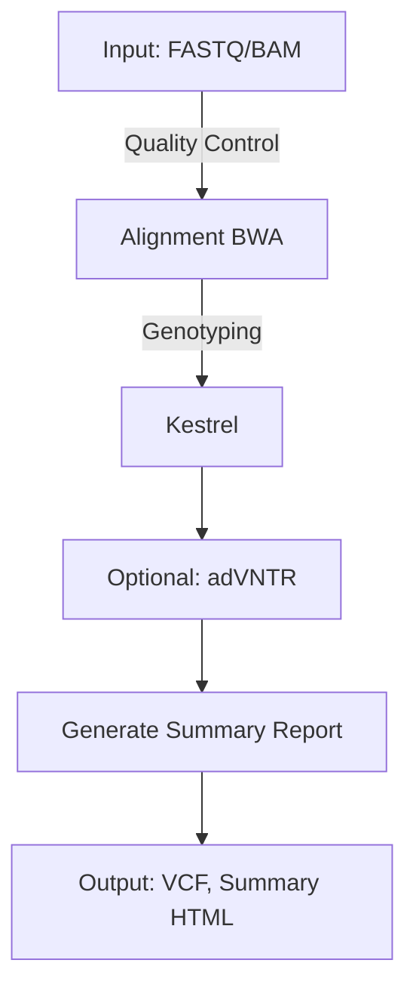

# VNtyper 2.0 - A Pipeline to genotype the MUC1-VNTR

**VNtyper 2.0** is an advanced pipeline designed to genotype MUC1 coding Variable Number Tandem Repeats (VNTR) in Autosomal Dominant Tubulointerstitial Kidney Disease (ADTKD-MUC1) using Short-Read Sequencing (SRS) data. This version integrates enhanced variant calling algorithms, robust logging mechanisms, and streamlined installation processes to provide researchers with a powerful tool for VNTR analysis.

- We have developed a web server to provide free access to VNtyper, which runs in the background for ease of use.  
  Access it through the following link: [vntyper-online](https://vntyper.org/)

---

## Table of Contents

1. [Features](#features)  
2. [Installation](#installation)  
3. [Usage](#usage)  
4. [Pipeline Overview](#pipeline-overview)  
5. [Dependencies](#dependencies)  
6. [Linting and Code Formatting](#linting-and-code-formatting)  
7. [Pipeline Logic Diagram](#pipeline-logic-diagram)  
8. [Results](#results)  
9. [Notes](#notes)  
10. [Citations](#citations)  
11. [Contributing](#contributing)  
12. [License](#license)  
13. [Contact](#contact)

---

## Features

- **Variant Calling Algorithms:**
  - **Kestrel:** Mapping-free genotyping using k-mer frequencies.
  - **code-adVNTR (optional):** Profile-HMM-based method for VNTR genotyping.
  - **SHARK (optional, FASTQ-only):** Rapid filtering and read extraction for MUC1 region in exome/whole-genome data.

- **Comprehensive Logging:**
  - Logs both to the console and a dedicated log file.
  - Generates MD5 checksums for all downloaded and processed files.

- **Flexible Installation:**
  - Supports installation via `pip` using `setup.py`.
  - Provides Conda environment setup for easy dependency management.

- **Subcommands:**
  - `install-references`
  - `pipeline`
  - `fastq`
  - `bam`
  - `kestrel`
  - `report`
  - `cohort`
  - `online`

---

## Installation

VNtyper 2.0 can be installed using either `pip` with `setup.py` or via Conda environments for streamlined dependency management.

### Using `setup.py` and `pip`

1. **Clone the Repository:**

   ```bash
   mkdir vntyper
   git clone https://github.com/hassansaei/vntyper.git
   cd vntyper
   pip install .
   ```

---

## Usage

VNtyper 2.0 offers multiple subcommands that can be used depending on your input data and requirements. Below are the main subcommands available:

### 1. Running the Full Pipeline

To run the entire pipeline using a BAM file:

```bash
vntyper --config-path /path/to/config.json pipeline \
    --bam /path/to/sample.bam \
    --output-dir /path/to/output/dir \
    --threads 4 --fast-mode
```

Alternatively, using paired-end FASTQ files:

```bash
vntyper --config-path /path/to/config.json pipeline \
    --fastq1 /path/to/sample_R1.fastq.gz \
    --fastq2 /path/to/sample_R2.fastq.gz \
    --output-dir /path/to/output/dir \
    --threads 4 --fast-mode
```

The adVNTR genotyping is optional and skipped by default. To enable adVNTR genotyping, use the `--extra-modules advntr` option.

**New**: To enable SHARK filtering on FASTQ reads *before* the usual QC and alignment (for improved MUC1 detection), add `shark` to the `--extra-modules` flag (e.g., `--extra-modules shark`). This can be done as:

```bash
vntyper --config-path /path/to/config.json pipeline \
    --fastq1 /path/to/sample_R1.fastq.gz \
    --fastq2 /path/to/sample_R2.fastq.gz \
    --extra-modules shark \
    --threads 4 \
    --output-dir /path/to/output/dir
```

- SHARK will run first on the raw FASTQ files to extract and filter reads covering the MUC1 VNTR region.  
- **Important**: SHARK is only supported in FASTQ mode. If you try to use `--extra-modules shark` together with `--bam` or `--cram`, VNtyper will exit gracefully with a warning.

### 2. Running VNtyper with Docker

Docker image for VNtyper 2.0 is provided and can be pulled and used as follows:

```bash
# pull the docker image
docker pull saei/vntyper:main

# run the pipeline using the docker image
docker run -w /opt/vntyper --rm \
    -v /local/input/folder/:/opt/vntyper/input \
    -v /local/output/folder/:/opt/vntyper/output \
    saei/vntyper:main \
    vntyper pipeline \
    --bam /opt/vntyper/input/filename.bam \
    -o /opt/vntyper/output/filename/
```

> **Important Host Volume Permissions Note:**  
> When mounting host directories into the container (using the `-v` flag), please ensure that the host directories (e.g., `/local/input/folder/` and `/local/output/folder/`) have the appropriate permissions so that they are writable by the container's non-root user.
>
> **Why Non-Root?**  
> VNtyper runs as a non-root user for enhanced security and to avoid file ownership issues on your host. Running as root may create files owned by root, leading to permission problems later.
>
> There are two ways to ensure proper permissions:
>
> 1. **Adjust Host Directory Permissions:**  
>    Change the ownership/permissions on the host directories so that the UID and GID match those expected by VNtyper in the container.
>
> 2. **Use the `--user` Flag:**  
>    Run the container with the `--user` flag to specify your current user’s UID and GID. For example:
>
>    ```bash
>    docker run --user $(id -u):$(id -g) -w /opt/vntyper --rm \
>      -v /local/input/folder/:/opt/vntyper/input \
>      -v /local/output/folder/:/opt/vntyper/output \
>      saei/vntyper:main \
>      vntyper pipeline \
>      --bam /opt/vntyper/input/filename.bam \
>      -o /opt/vntyper/output/filename/
>    ```
>
> Using either method ensures VNtyper can write its log files (e.g., `pipeline.log`) and other outputs without encountering permission errors.

An Apptainer image can be generated from the Docker image as follows:

```bash
# create the apptainer sif image
apptainer pull docker://saei/vntyper:main

# run the pipeline using the apptainer image
apptainer run --pwd /opt/vntyper \
    -B /local/input/folder/:/opt/vntyper/input \
    -B /local/output/folder/:/opt/vntyper/output \
    vntyper_main.sif vntyper pipeline \
    --bam /opt/vntyper/input/filename.bam \
    -o /opt/vntyper/output/filename/
```

### 3. Installing References

```bash
vntyper --config-path /path/to/config.json install-references \
    --output-dir /path/to/reference/install \
    --skip-indexing  # Optional: skip BWA indexing if needed
```

### 4. Generating Reports

```bash
vntyper --config-path /path/to/config.json report \
    --output-dir /path/to/output/dir
```

---

## Pipeline Overview

VNtyper 2.0 integrates multiple steps into a streamlined pipeline. The following is an overview of the steps involved:

1. **FASTQ Quality Control**: Raw FASTQ files are checked for quality.  
2. **(Optional) SHARK Filtering**: If `shark` is specified in `--extra-modules`, raw FASTQ reads are first filtered to extract MUC1-specific reads (especially relevant for exome or large WGS datasets).  
3. **Alignment**: Reads are aligned using BWA (if FASTQ files are provided).  
4. **Kestrel Genotyping**: Mapping-free genotyping of VNTRs.  
5. **(Optional) adVNTR Genotyping**: Profile-HMM-based method for VNTR genotyping (requires additional setup).  
6. **Summary Report Generation**: A final HTML report is generated to summarize the results.

---

## Dependencies

VNtyper 2.0 relies on several tools and Python libraries. Ensure that the following dependencies are available in your environment:

- Python >= 3.9  
- BWA  
- Samtools  
- Fastp  
- Pandas  
- Numpy  
- Biopython  
- Pysam  
- Jinja2  
- Matplotlib  
- Seaborn  
- IGV-Reports  

You can easily set up these dependencies via the provided Conda environment file.

---

## Linting and Code Formatting

VNtyper adheres to PEP8 style guidelines to ensure clean, readable, and maintainable code. We recommend the following tools:

### Using flake8 for Linting

**flake8** is used to check for style violations. Note that flake8 only reports issues—it does not automatically fix them.

1. **Install flake8:**  
   You can install it as part of the development extras:

   ```bash
   pip install -e .[dev]
   ```

   *Or install it directly:*

   ```bash
   pip install flake8
   ```

2. **Run flake8:**  
   To check your code, run the following command from the project root:

   ```bash
   flake8 .
   ```

   This command will recursively scan your project and report any PEP8 issues.

### Automatic Code Formatting with Black

For automatic formatting, we use **Black**, which is already included in the development extras.

1. **Run Black:**  
   Simply execute the following command in the project root:

   ```bash
   black .
   ```

   Black will automatically reformat your code according to its opinionated style, which is also compliant with PEP8.

---

## Pipeline Logic Diagram

Below is a logical overview of the VNtyper pipeline:



---

## Results

Once the pipeline completes, you will have:

- **BAM or FASTQ** slices containing MUC1-specific reads.  
- **VCF files** or **TSV files** with genotyping results (for Kestrel and optional adVNTR).  
- **HTML summary report** detailing coverage stats, genotyping calls, and relevant logs.

---

## Notes

1. This tool is for **research use only**.  
2. Ensure **high-coverage WES/WGS or targeted data** is used to genotype MUC1 VNTR accurately.  
3. For questions or issues, refer to the GitHub repository for support.

---

## Citations

If you use VNtyper 2.0 in your research, please cite the following:

1. Saei H, Morinière V, Heidet L, et al. VNtyper enables accurate alignment-free genotyping of MUC1 coding VNTR using short-read sequencing data. iScience. 2023.  
2. Audano PA, Ravishankar S, et al. Mapping-free variant calling using haplotype reconstruction from k-mer frequencies. Bioinformatics. 2018.  
3. Park J, Bakhtiari M, et al. Detecting tandem repeat variants in coding regions using code-adVNTR. iScience. 2022.

---

## Contributing

We welcome contributions to VNtyper. Please refer to the [CONTRIBUTING.md](CONTRIBUTING.md) file for guidelines.

---

## License

VNtyper is licensed under the BSD 3-Clause License. See the LICENSE file for more details.

---

## Contact

For questions or issues, please open an [issue on GitHub](https://github.com/hassansaei/vntyper/issues) or email the corresponding authors listed in the manuscript.
