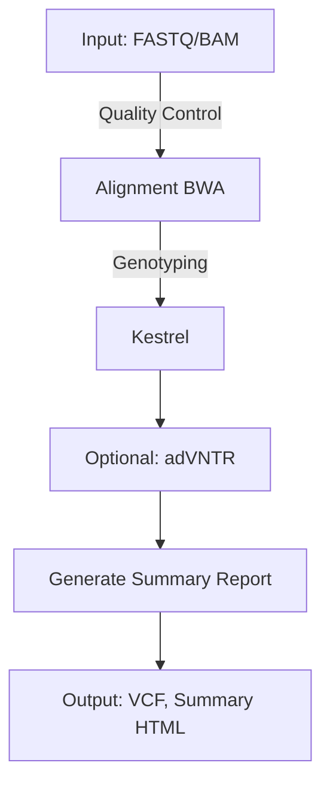

# VNtyper 2.0 - A Pipeline to genotype the MUC1-VNTR

**VNtyper 2.0** is an advanced pipeline designed to genotype MUC1 coding Variable Number Tandem Repeats (VNTR) in Autosomal Dominant Tubulointerstitial Kidney Disease (ADTKD-MUC1) using Short-Read Sequencing (SRS) data. This version integrates enhanced variant calling algorithms, robust logging mechanisms, and streamlined installation processes to provide researchers with a powerful tool for VNTR analysis.

---

## Table of Contents

1. [Features](#features)
2. [Installation](#installation)
3. [Usage](#usage)
4. [Pipeline Overview](#pipeline-overview)
5. [Dependencies](#dependencies)
6. [Pipeline Logic Diagram](#pipeline-logic-diagram)
7. [Results](#results)
8. [Notes](#notes)
9. [Citations](#citations)
10. [Contributing](#contributing)
11. [License](#license)
12. [Contact](#contact)

---

## Features

- **Variant Calling Algorithms:**
  - **Kestrel:** Mapping-free genotyping using k-mer frequencies.
  - **code-adVNTR (optional):** Profile-HMM based method for VNTR genotyping.

- **Comprehensive Logging:**
  - Logs both to the console and a dedicated log file.
  - Generates MD5 checksums for all downloaded and processed files.

- **Flexible Installation:**
  - Supports installation via `pip` using `setup.py`.
  - Provides Conda environment setup for easy dependency management.

- **Subcommands:**
  - `install-references`
  - `pipeline`
  - `fastq`
  - `bam`
  - `kestrel`
  - `report`
  - `cohort`

---

## Installation

VNtyper 2.0 can be installed using either `pip` with `setup.py` or via Conda environments for streamlined dependency management.

### Using `setup.py` and `pip`

1. **Clone the Repository:**

   ```bash
   mkdir vntyper
   git clone https://github.com/hassansaei/vntyper.git
   cd vntyper
   pip install .
   ```

---

## Usage

VNtyper 2.0 offers multiple subcommands that can be used depending on your input data and requirements. Below are the main subcommands available:

### 1. Running the Full Pipeline

To run the entire pipeline on paired-end FASTQ files or BAM files:

```bash
vntyper pipeline \
    --config-path /path/to/config.json \
    --fastq1 /path/to/sample_R1.fastq.gz \
    --fastq2 /path/to/sample_R2.fastq.gz \
    --output-dir /path/to/output/dir \
    --threads 4
```

Alternatively, using a BAM file:

```bash
vntyper pipeline \
    --config-path /path/to/config.json \
    --bam /path/to/sample.bam \
    --output-dir /path/to/output/dir \
    --threads 4
```


### 2. Installing References

```bash
vntyper install-references \
    --output-dir /path/to/reference/install \
    --config-path /path/to/config.json \
    --skip-indexing  # Optional: skip BWA indexing if needed
```

### 3. Generating Reports

Generate a summary report for your VNTR genotyping analysis:

```bash
vntyper report \
    --output-dir /path/to/output/dir \
    --config-path /path/to/config.json

```bash
vntyper fastq \
    --fastq1 /path/to/sample_R1.fastq.gz \
    --fastq2 /path/to/sample_R2.fastq.gz \
    --output-dir /path/to/output/dir

```bash
vntyper bam \
    --alignment /path/to/sample.bam \
    --output-dir /path/to/output/dir \
    --threads 4
```

---

## Pipeline Overview
=======

VNtyper 2.0 integrates multiple steps into a streamlined pipeline. The following is an overview of the steps involved:

1. **FASTQ Quality Control**: Raw FASTQ files are checked for quality.
2. **Alignment**: Reads are aligned using BWA (if FASTQ files are provided).
3. **Kestrel Genotyping**: Mapping-free genotyping of VNTRs.
4. **(Optional) adVNTR Genotyping**: Profile-HMM based method for VNTR genotyping (requires additional setup).
5. **Summary Report Generation**: A final HTML report is generated to summarize the results.

---

## Dependencies

VNtyper 2.0 relies on several tools and Python libraries. Ensure that the following dependencies are available in your environment:

- Python >= 3.9
- BWA
- Samtools
- Fastp
- Pandas
- Numpy
- Biopython
- Pysam
- Jinja2
- Matplotlib
- Seaborn
- IGV-Reports

You can easily set up these dependencies via the provided Conda environment file.

---

## Pipeline Logic Diagram

Below is a logical overview of the VNtyper pipeline:



---

## Notes

1. This tool is for **research use only**.
2. Ensure **high-coverage WES data** is used to genotype MUC1 VNTR accurately.
3. For questions or issues, refer to the GitHub repository for support.

---

If you use VNtyper 2.0 in your research, please cite the following:

1. Saei H, Morinière V, Heidet L, et al. VNtyper enables accurate alignment-free genotyping of MUC1 coding VNTR using short-read sequencing data. iScience. 2023.
2. Audano PA, Ravishankar S, et al. Mapping-free variant calling using haplotype reconstruction from k-mer frequencies. Bioinformatics. 2018.
3. Park J, Bakhtiari M, et al. Detecting tandem repeat variants in coding regions using code-adVNTR. iScience. 2022.

---

## Contributing

We welcome contributions to VNtyper. Please refer to the [CONTRIBUTING.md](CONTRIBUTING.md) file for guidelines.

---

## License

VNtyper is licensed under the BSD 3-Clause License. See the LICENSE file for more details.

---
