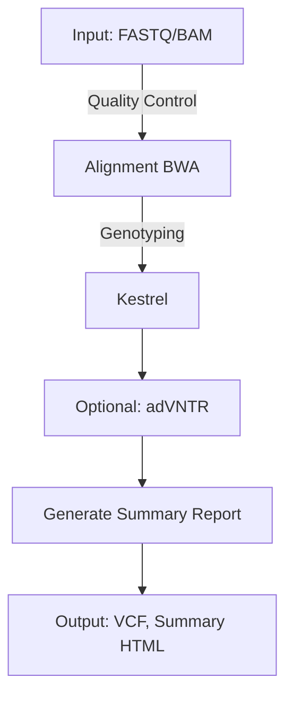

# VNtyper 2.0 - A Pipeline to genotype the MUC1-VNTR

**VNtyper 2.0** is an advanced pipeline designed to genotype MUC1 coding Variable Number Tandem Repeats (VNTR) in Autosomal Dominant Tubulointerstitial Kidney Disease (ADTKD-MUC1) using Short-Read Sequencing (SRS) data. This version integrates enhanced variant calling algorithms, robust logging mechanisms, and streamlined installation processes to provide researchers with a powerful tool for VNTR analysis.

---

## Table of Contents

1. [Features](#features)
2. [Installation](#installation)
3. [Usage](#usage)
4. [Pipeline Overview](#pipeline-overview)
5. [Dependencies](#dependencies)
6. [Pipeline Logic Diagram](#pipeline-logic-diagram)
7. [Results](#results)
8. [Notes](#notes)
9. [Citations](#citations)
10. [Contributing](#contributing)
11. [License](#license)
12. [Contact](#contact)

---

## Features

- **Variant Calling Algorithms:**
  - **Kestrel:** Mapping-free genotyping using k-mer frequencies.
  - **code-adVNTR (optional):** Profile-HMM based method for VNTR genotyping.

- **Comprehensive Logging:**
  - Logs both to the console and a dedicated log file.
  - Generates MD5 checksums for all downloaded and processed files.

- **Flexible Installation:**
  - Supports installation via `pip` using `setup.py`.
  - Provides Conda environment setup for easy dependency management.

- **Subcommands:**
  - `install-references`
  - `pipeline`
  - `fastq`
  - `bam`
  - `kestrel`
  - `report`
  - `cohort`

---

## Installation

VNtyper 2.0 can be installed using either `pip` with `setup.py` or via Conda environments for streamlined dependency management.

### Using `setup.py` and `pip`

1. **Clone the Repository:**

   ```bash
   mkdir vntyper
   git clone https://github.com/hassansaei/vntyper.git
   cd vntyper
   pip install .
   ```

---

## Usage

VNtyper 2.0 offers multiple subcommands that can be used depending on your input data and requirements. Below are the main subcommands available:

### 1. Running the Full Pipeline

To run the entire pipeline on paired-end FASTQ files or BAM files:

```bash
vntyper pipeline \
    --config-path /path/to/config.json \
    --fastq1 /path/to/sample_R1.fastq.gz \
    --fastq2 /path/to/sample_R2.fastq.gz \
    --output-dir /path/to/output/dir \
    --threads 4
=======
## VNtyper - A pipeline to genotype MUC1-VNTR 
Genotyping MUC1 coding-VNTR in ADTKD-MUC1 using short-read sequencing (SRS) data. Vntyper pipeline embedded two different variant calling algorithms:
- Mapping free genotyping using kmer frequencies [(Kestrel)](https://github.com/paudano/kestrel)
- Profile-HMM based method [(code-adVNTR)](https://github.com/mehrdadbakhtiari/adVNTR/tree/enhanced_hmm)

## Installation & Requirements
The tool can be downloaded by cloning from the GitHub page (You should have sudo access to the server, otherwise you can use docker/singularity image):

```bashscript
# Make a directory that you want to download VNtyper
mkdir vntyper
git clone https://github.com/hassansaei/VNtyper.git
# Go to the directory in which you downloaded the source code
cd VNtyper

```

Alternatively, using a BAM file:

```bash
vntyper pipeline \
    --config-path /path/to/config.json \
    --bam /path/to/sample.bam \
    --output-dir /path/to/output/dir \
    --threads 4
```


### 2. Installing References

```bash
vntyper install-references \
    --output-dir /path/to/reference/install \
    --config-path /path/to/config.json \
    --skip-indexing  # Optional: skip BWA indexing if needed
```

### 3. Generating Reports

Generate a summary report for your VNTR genotyping analysis:

```bash
vntyper report \
    --output-dir /path/to/output/dir \
    --config-path /path/to/config.json
=======
The requirements are as follows:
1. Python >= 3.9 and libraries
    - Pandas ``` pip3 install pandas```
    - numpy ``` pip3 install numpy```
    - regex ``` pip3 install regex```
    - biopython ``` pip3 install biopython ```
    - setuptools==58 ``` pip3 install setuptools```
    - pysam ``` pip3 install pysam ```

3. Install [(BWA)](https://bio-bwa.sourceforge.net/)
4. Download chr1.fa file form [(UCSC genome browser)](https://hgdownload.soe.ucsc.edu/goldenPath/hg19/chromosomes/chr1.fa.gz)
5. Index fasta file with BWA
6. Install Singularity
7. Download [(Kestrel)](https://github.com/paudano/kestrel)
8. Building singularity image for code-adVNTR
9. Download [(VNTR database)](https://cseweb.ucsd.edu/~mbakhtia/adVNTR/vntr_data_genic_loci.zip) for code-adVNTR
10. The MUC1 VNTR motif dictionary and index files are provided in the File directory

## VNtyper docker image

Docker image is also provided and can be pulled from the docker hub. 
You have to make a directory to store both you inputs and outputs in the host machine.
The instructions for installing docker on Linux can be found [(here)](https://docs.docker.com/desktop/install/linux-install/)

```bashscript
mkdir shared
sudo docker pull saei/vntyper:1.3.0

```

### 4. Processing FASTQ Files


Process raw FASTQ files to prepare them for genotyping:

```bash
vntyper fastq \
    --fastq1 /path/to/sample_R1.fastq.gz \
    --fastq2 /path/to/sample_R2.fastq.gz \
    --output-dir /path/to/output/dir
=======
```bashscript
sudo docker run --rm -it -v /PATH to the shared directory/shared:/SOFT/shared saei/vntyper:1.3.0 \
-t 8 --bam  --hg19[or --hg38] -p /SOFT/VNtyper/ -ref  /SOFT/VNtyper/Files/chr1.fa  \
-ref_VNTR /SOFT/VNtyper/Files/MUC1-VNTR.fa \
-a /SOFT/shared/SAAMPLE.bam -t 8 -w /SOFT/shared/ -o SAMPLE_NAME --ignore_advntr

```

### 5. Processing BAM Files


Process BAM files and convert them to FASTQ files for genotyping:
=======
sudo docker run --rm -it -v /PATH to the shared directory/shared:/SOFT/shared saei/vntyper:1.3.0 \
-t 8 --bam  --hg19 -p /SOFT/VNtyper/  -ref  /SOFT/VNtyper/Files/chr1.fa  \
-ref_VNTR /SOFT/VNtyper/Files/MUC1-VNTR.fa  -m /SOFT/VNtyper/Files/hg19_genic_VNTRs.db \
-a /SOFT/shared/SAMPLE.bam -t 8 -w /SOFT/shared/ -o SAMPLE_NAME


```bash
vntyper bam \
    --alignment /path/to/sample.bam \
    --output-dir /path/to/output/dir \
    --threads 4
```


---

## Pipeline Overview
=======
## Execution
Use the following command to see the help for running the tool.

```bashscript
python3 VNtyper.py --help 

usage: VNtyper.py [-h] [--version] -ref Referense [-r1 FASTQ1] [-r2 FASTQ2] -o OUTPUT -ref_VNTR Referense [-t THREADS] -p TOOLS_PATH -w WORKING_DIR [-m REFERENCE_VNTR]
                  [--ignore_advntr] [--bam] [--hg19] [--hg38] [--fastq] [-a ALIGNMENT] [-c CUSTOM_REGION]

Given raw fastq files or BAM files, this pipeline genotype MUC1-VNTR using two independent genotyping methods (Kestrel and code-adVNTR)

options:
  -h, --help            show this help message and exit
  --version             show program's version number and exit
  -ref Referense, --reference_file Referense
                        FASTA-formatted reference file and indexes for read alignment
  -r1 FASTQ1, --fastq1 FASTQ1
                        Fastq file first pair
  -r2 FASTQ2, --fastq2 FASTQ2
                        Fastq file second pair
  -o OUTPUT, --output OUTPUT
                        Output file name
  -ref_VNTR Referense, --reference_VNTR Referense
                        MUC1-specific reference file
  -t THREADS, --threads THREADS
                        Number of threads (CPU)
  -p TOOLS_PATH, --tools_path TOOLS_PATH
                        Path to the VNtyper directory
  -w WORKING_DIR, --working_dir WORKING_DIR
                        the path to the output
  -m REFERENCE_VNTR, --reference_vntr REFERENCE_VNTR
                        adVNTR reference vntr database
  --ignore_advntr       Skip adVNTR genotyping of MUC1-VNTR
  --bam                 BAM file as an input
  --hg19                Input bam is from hg19 alignment
  --hg38                Input bam is from hg38 alignment
  --fastq               Paired-end fastq files as an input
  -a ALIGNMENT, --alignment ALIGNMENT
                        Alignment File (with an index file .bai)
  -c CUSTOM_REGION, --custom_region CUSTOM_REGION
                        Custom region for MUC1 gene to be subseted in the provided BAM file


VNtyper 2.0 integrates multiple steps into a streamlined pipeline. The following is an overview of the steps involved:

1. **FASTQ Quality Control**: Raw FASTQ files are checked for quality.
2. **Alignment**: Reads are aligned using BWA (if FASTQ files are provided).
3. **Kestrel Genotyping**: Mapping-free genotyping of VNTRs.
4. **(Optional) adVNTR Genotyping**: Profile-HMM based method for VNTR genotyping (requires additional setup).
5. **Summary Report Generation**: A final HTML report is generated to summarize the results.

---

## Dependencies

VNtyper 2.0 relies on several tools and Python libraries. Ensure that the following dependencies are available in your environment:

- Python >= 3.9
- BWA
- Samtools
- Fastp
- Pandas
- Numpy
- Biopython
- Pysam
- Jinja2
- Matplotlib
- Seaborn
- IGV-Reports

You can easily set up these dependencies via the provided Conda environment file.

---

## Pipeline Logic Diagram

Below is a logical overview of the VNtyper pipeline:



---

## Results

The final output of the VNtyper pipeline is stored in the specified output directory and includes:


- **VCF File**: Contains variant information.
- **HTML Summary Report**: A detailed summary of the results.
- **Log Files**: Logs all steps and potential issues during the pipeline run.
=======
## Output
The tool creates a folder for each case in the working directory which is assigned by the user. Inside the folder there is a directory for temporary files and log files, and the final output:
- Temp folder: Fastp QC report (.html) and log file for VNtyper
- The output of VNtyper '*_Final_result.tsv'


---


## Notes

1. This tool is for **research use only**.
2. Ensure **high-coverage WES data** is used to genotype MUC1 VNTR accurately.
3. For questions or issues, refer to the GitHub repository for support.

---

## Citations
=======
The Kestrel output is a VCF file, which is processed by VNtyper and the final result is stored in *_Final_result.tsv. The resulting file contains information for the motifs, varinant types, position of the variant, and its corresponding depth. The output for code-adVNTR is a bed or vcf file with variant information and P-value.


## Citations
1. Saei H, Morinière V, Heidet L, Gribouval O, Lebbah S, Tores F, Mautret-Godefroy M, Knebelmann B, Burtey S, Vuiblet V, Antignac C, Nitschké P, Dorval G. VNtyper enables accurate alignment-free genotyping of MUC1 coding VNTR using short-read sequencing data in autosomal dominant tubulointerstitial kidney disease. iScience. 2023 Jun 17;26(7):107171. https://doi.org/10.1016/j.isci.2023.107171
   
2. Peter A Audano, Shashidhar Ravishankar, Fredrik O Vannberg, Mapping-free variant calling using haplotype reconstruction from k-mer frequencies, Bioinformatics, Volume 34, Issue 10, May 2018, Pages 1659–1665, https://doi.org/10.1093/bioinformatics/btx753
   
3. Park J, Bakhtiari M, Popp B, Wiesener M, Bafna V. Detecting tandem repeat variants in coding regions using code-adVNTR. iScience. 2022 Jul 19;25(8):104785. https://doi.org/10.1016/j.isci.2022.104785 


If you use VNtyper 2.0 in your research, please cite the following:

1. Saei H, Morinière V, Heidet L, et al. VNtyper enables accurate alignment-free genotyping of MUC1 coding VNTR using short-read sequencing data. iScience. 2023.
2. Audano PA, Ravishankar S, et al. Mapping-free variant calling using haplotype reconstruction from k-mer frequencies. Bioinformatics. 2018.
3. Park J, Bakhtiari M, et al. Detecting tandem repeat variants in coding regions using code-adVNTR. iScience. 2022.

---

## Contributing

We welcome contributions to VNtyper. Please refer to the [CONTRIBUTING.md](CONTRIBUTING.md) file for guidelines.

---

## License

VNtyper is licensed under the MIT License. See the LICENSE file for more details.

---
