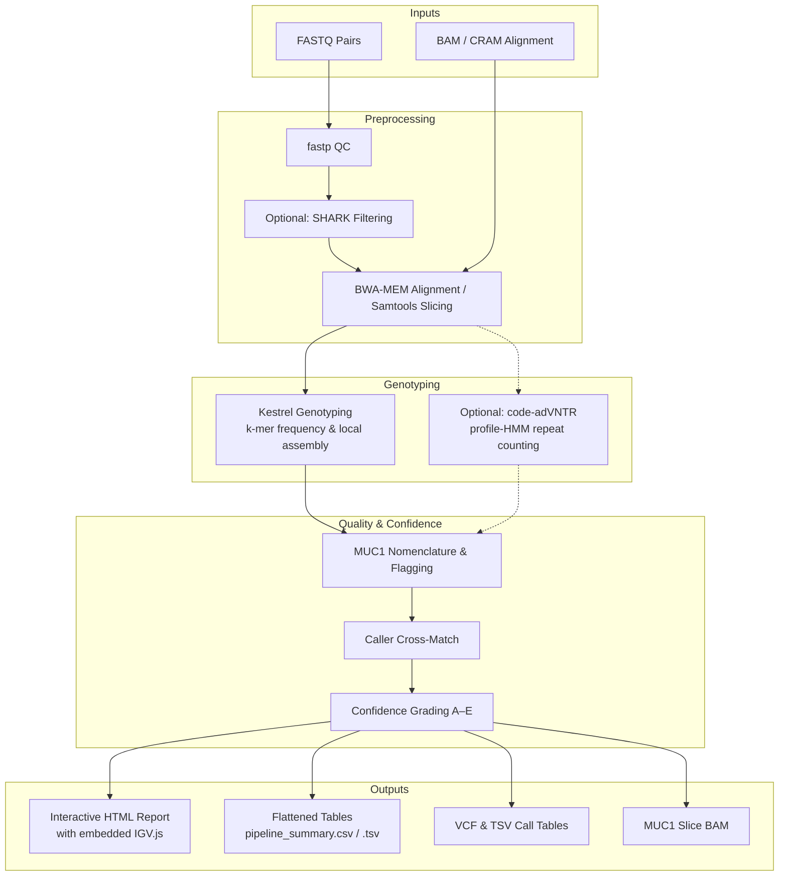

# VNtyper 2 - A Pipeline to genotype the MUC1-VNTR

[](https://github.com/hassansaei/VNtyper/actions/workflows/ci-tests.yml)
[](https://github.com/hassansaei/VNtyper/actions/workflows/docker-build.yml)
[](https://pypi.org/project/vntyper/)
[](https://pypi.org/project/vntyper/)
[](LICENSE)
[](https://doi.org/10.5281/zenodo.19744166)
[](https://doi.org/10.64898/2026.05.27.26352937)
[](https://vntyper.org/)

**VNtyper 2** is an advanced pipeline designed to genotype MUC1 coding Variable Number Tandem Repeats (VNTR) in Autosomal Dominant Tubulointerstitial Kidney Disease (ADTKD-MUC1) using Short-Read Sequencing (SRS) data. This refactored version of VNtyper v1 integrates enhanced variant calling algorithms, robust logging mechanisms, and streamlined installation processes to provide researchers with a powerful tool for VNTR analysis.

> [!TIP]
> **No local installation needed? Try VNtyper-Online!**  
> Access our freely available web server at [vntyper.org](https://vntyper.org/) for rapid, browser-based analysis without managing local bioinformatics software.

> [!NOTE]
> **Preprint Available:**  
> Popp B, Saei H, Teltsh O, et al. *VNtyper 2 enables open-access short-read genotyping of MUC1 VNTR variants in ADTKD at high-speed*. **medRxiv** (2026). [doi:10.64898/2026.05.27.26352937](https://doi.org/10.64898/2026.05.27.26352937).

---

## Table of Contents

1. [Features](#features)
2. [Installation](#installation)
   - [Conda / Mamba (Recommended)](#conda--mamba-recommended)
   - [Docker & Apptainer (Zero-Setup)](#docker--apptainer-zero-setup)
   - [Python Package (pip)](#python-package-pip)
   - [Reference Data Setup](#reference-data-setup)
3. [Usage](#usage)
   - [1. Running the Genotyping Pipeline](#1-running-the-genotyping-pipeline)
   - [2. Running with Docker & Apptainer](#2-running-with-docker--apptainer)
   - [3. Installing References](#3-installing-references)
   - [4. Regenerating Reports](#4-regenerating-reports)
   - [5. Cohort Analysis](#5-cohort-analysis)
   - [6. Online Mode](#6-online-mode)
4. [Pipeline Architecture](#pipeline-architecture)
5. [Outputs & Results](#outputs--results)
6. [Dependencies](#dependencies)
7. [Important Notes](#important-notes)
8. [Citations](#citations)
9. [Contributing](#contributing)
10. [License](#license)
11. [Contact](#contact)

---

## Features

- **Multi-Method Variant Calling:**
  - **Kestrel:** Mapping-free genotyping via k-mer frequency analysis and local haplotype reconstruction.
  - **code-adVNTR (optional):** Profile-HMM-based method for VNTR repeat-unit counting and genotyping.
  - **SHARK (optional, FASTQ-only):** Rapid k-mer filtering to extract MUC1-relevant reads from large WGS or exome datasets.
- **Config-Driven Confidence & Quality Control:**
  - **Confidence Grades (A–E):** First-match, evidence-ranked grading on screening summaries.
  - **Automated Cross-Match:** Concordance assessment between Kestrel and adVNTR calls.
  - **Coverage QC:** Dedicated coverage statistics across the VNTR region (mean, median, zero-coverage fraction).
- **Rich Reporting & Downstream Integration:**
  - **Interactive HTML Report:** Includes a self-contained, embedded IGV.js alignment browser (`--report-igv embedded`) that works offline.
  - **Tabular Exports:** Tab-separated and comma-separated summary tables (`pipeline_summary.csv`, `.tsv`, `_rows.tsv`) with full run provenance.
  - **Standard Formats:** Emits standard VCF files and detailed k-mer frequency tables.
- **Cohort-Level Aggregation:**
  - `vntyper cohort` aggregates multiple sample runs into cohort-wide summaries with call frequency statistics and configurable rarity thresholds.
- **Fault-Tolerant Execution:**
  - Resumption support (`--resume`) reuses completed stages after interruption.
  - Comprehensive audit logs (`pipeline.log`) with MD5 file checksums.

---

## Installation

VNtyper 2 uses modern Python packaging with `pyproject.toml` and can be installed via Conda/Mamba, container images, or `pip`.

### Conda / Mamba (Recommended)

Because VNtyper requires external bioinformatics binaries (`bwa`, `samtools`, `fastp`, `bcftools`, and Java 11 for Kestrel), installing via Conda or Mamba provides the full environment:

```bash
# 1. Clone the repository
git clone https://github.com/hassansaei/VNtyper.git
cd VNtyper

# 2. Create and activate the conda environment
mamba env create -f conda/environment_vntyper.yml
conda activate vntyper

# 3. Install VNtyper in editable mode
pip install -e .
```

For development and running tests, install with dev dependencies:

```bash
pip install -e .[dev]
```

### Docker & Apptainer (Zero-Setup)

For users who prefer pre-configured environments with all dependencies and reference data bundled, prebuilt images are available on GitHub Packages (GHCR). See [Running with Docker & Apptainer](#2-running-with-docker--apptainer).

### Python Package (`pip`)

If you already have the external binaries installed and available in your `PATH` (e.g., in an existing HPC module environment):

```bash
pip install vntyper
```

### Reference Data Setup

Before running the pipeline locally, install the required reference bundle (includes human reference genomes and MUC1 target models):

```bash
vntyper install-references --output-dir /path/to/reference/
```

By default, this downloads the pre-built reference bundle verified with SHA-256 checksums.

---

## Usage

VNtyper 2 offers multiple subcommands that can be used depending on your input data and requirements. Below are the main subcommands available:

- `pipeline` — Run the full genotyping pipeline on BAM, CRAM, or paired FASTQ files.
- `report` — Regenerate HTML and TSV reports from an existing run directory.
- `cohort` — Aggregate multiple run directories into a cohort summary with call frequencies.
- `install-references` — Download or build reference files and motif databases.
- `online` — Extract a MUC1 BAM slice and submit it to the VNtyper-Online web platform.
- `calibrate` — Extract, fit, or evaluate opt-in calibration profiles.

### 1. Running the Genotyping Pipeline

#### With BAM Input

```bash
vntyper pipeline \
    --bam /data/inputs/sample.bam \
    --output-dir /data/results/sample/ \
    --threads 4 \
    --fast-mode
```

> [!IMPORTANT]
> **Keep output separate from input**: For BAM and CRAM runs, keep `--output-dir` outside the directory containing the alignment. Separate `inputs/` and `results/` trees satisfy that ownership boundary.

#### With CRAM Input

When providing CRAM files, supply the matching reference FASTA for decompression:

```bash
vntyper pipeline \
    --cram /data/inputs/sample.cram \
    --reference-fasta /data/reference/genome.fa \
    --output-dir /data/results/sample/ \
    --threads 4 \
    --fast-mode
```

#### With Paired-End FASTQ Input

```bash
vntyper pipeline \
    --fastq1 /data/inputs/sample_R1.fastq.gz \
    --fastq2 /data/inputs/sample_R2.fastq.gz \
    --output-dir /data/results/sample/ \
    --threads 4 \
    --fast-mode
```

#### Resuming an Interrupted Run

Use `--resume` to safely pick up an existing run directory without recomputing finished stages:

```bash
vntyper pipeline \
    --bam /data/inputs/sample.bam \
    --output-dir /data/results/sample/ \
    --threads 4 \
    --resume
```

#### Enabling Optional Modules (adVNTR & SHARK)

- **adVNTR**: Profile-HMM genotyping is disabled by default. Enable it with `--extra-modules advntr`.
- **SHARK**: Rapid k-mer pre-filtering on raw FASTQ files before alignment. Enable it with `--extra-modules shark` (FASTQ-only):

```bash
vntyper pipeline \
    --fastq1 /data/inputs/sample_R1.fastq.gz \
    --fastq2 /data/inputs/sample_R2.fastq.gz \
    --extra-modules shark \
    --output-dir /data/results/sample/ \
    --threads 4
```

### 2. Running with Docker & Apptainer

Docker image for VNtyper 2 is provided and can be pulled and used as follows. Released images are published to GHCR as `latest` (the newest release), the immutable `vX.Y.Z` and `X.Y.Z` tags naming one exact release, and the moving `X` and `X.Y` series tags. Pin `vX.Y.Z` for a reproducible run. The `main` tag is rolling and tracks the default branch. Docker Hub artifacts are legacy, frozen, and unsupported.

#### Docker

```bash
# Pull the docker image
docker pull ghcr.io/hassansaei/vntyper:latest

# Run the pipeline using the docker image
docker run -w /opt/vntyper --rm \
    -v /local/input/folder/:/opt/vntyper/input \
    -v /local/output/folder/:/opt/vntyper/output \
    ghcr.io/hassansaei/vntyper:latest \
    vntyper pipeline \
    --bam /opt/vntyper/input/filename.bam \
    -o /opt/vntyper/output/filename/
```

> **Input and output must be two different host directories:**  
> VNtyper never writes into the directory holding the patient alignment, so mounting one
> host directory at both `/opt/vntyper/input` and `/opt/vntyper/output` is rejected with
> `Alignment output root must stay outside the patient input tree`. The check compares the
> directories themselves, not their names, so `-v .:/opt/vntyper/input -v .:/opt/vntyper/output`
> fails even though the two container paths differ. Mount a separate directory — for
> example `-v "$PWD/inputs":/opt/vntyper/input -v "$PWD/results":/opt/vntyper/output`.

> **Host Volume Permissions Note:**  
> VNtyper runs as a non-root user in the container for security. To ensure output files can be written:
>
> ```bash
> docker run --user $(id -u):$(id -g) -w /opt/vntyper --rm \
>     -v /local/input/folder/:/opt/vntyper/input \
>     -v /local/output/folder/:/opt/vntyper/output \
>     ghcr.io/hassansaei/vntyper:latest \
>     vntyper pipeline \
>     --bam /opt/vntyper/input/filename.bam \
>     -o /opt/vntyper/output/filename/
> ```

#### Apptainer / Singularity

An Apptainer image can be generated from the Docker image as follows:

```bash
# create the apptainer sif image
apptainer pull docker://ghcr.io/hassansaei/vntyper:latest

# run the pipeline using the apptainer image
apptainer run --pwd /opt/vntyper \
    -B /local/input/folder/:/opt/vntyper/input \
    -B /local/output/folder/:/opt/vntyper/output \
    vntyper_latest.sif vntyper pipeline \
    --bam /opt/vntyper/input/filename.bam \
    -o /opt/vntyper/output/filename/
```

### 3. Installing References

```bash
vntyper install-references \
    --output-dir /path/to/reference/install \
    --references hg19 hg38
```

### 4. Regenerating Reports

Re-generate HTML and TSV reports from an existing run directory without repeating upstream compute:

```bash
vntyper report \
    --output-dir /data/results/sample/
```

### 5. Cohort Analysis

Aggregate multiple sample directories into a cohort summary with call frequency distributions:

```bash
vntyper cohort \
    --input-dirs /data/results/sample1 /data/results/sample2 /data/results/sample3 \
    --output-dir /data/cohort_summary/ \
    --rare-allele-max-frequency 0.05
```

### 6. Online Mode

Extract a MUC1 alignment slice and submit it directly to VNtyper-Online:

```bash
vntyper online \
    --bam /data/inputs/sample.bam \
    --output-dir /data/results/online_submission/
```

---

## Pipeline Architecture

VNtyper 2 integrates multiple steps into a streamlined pipeline. The following is an overview of the steps involved:


```mermaid
flowchart TD
    subgraph Inputs
        A1[FASTQ Pairs]
        A2[BAM / CRAM Alignment]
    end

    subgraph Preprocessing
        B1[fastp QC]
        B2[Optional: SHARK Filtering]
        B3[BWA-MEM Alignment / Samtools Slicing]
    end

    subgraph Genotyping
        C1[Kestrel Genotyping<br/>k-mer frequency & local assembly]
        C2[Optional: code-adVNTR<br/>profile-HMM repeat counting]
    end

    subgraph Quality & Confidence
        D1[MUC1 Nomenclature & Flagging]
        D2[Caller Cross-Match]
        D3[Confidence Grading A–E]
    end

    subgraph Outputs
        E1[Interactive HTML Report<br/>with embedded IGV.js]
        E2[Flattened Tables<br/>pipeline_summary.csv / .tsv]
        E3[VCF & TSV Call Tables]
        E4[MUC1 Slice BAM]
    end

    A1 --> B1 --> B2 --> B3
    A2 --> B3
    B3 --> C1
    B3 -.-> C2
    C1 --> D1
    C2 -.-> D1
    D1 --> D2 --> D3
    D3 --> E1 & E2 & E3 & E4
```

1. **Pre-processing & QC**: Evaluates sequencing quality via `fastp`, optionally applies SHARK k-mer read fishing, and produces targeted MUC1 alignment slices.
2. **Kestrel Genotyping**: Mapping-free k-mer counting and local haplotype assembly over the MUC1 VNTR.
3. **Optional adVNTR Genotyping**: Profile-HMM genotyping for independent repeat-unit analysis.
4. **Nomenclature & Confidence Assignment**: Standardizes variant calls to canonical MUC1 nomenclature, evaluates evidence support, computes caller cross-match, and assigns confidence grades (A–E).
5. **Report Generation**: Emits interactive HTML reports (with offline IGV.js), flattened CSV/TSV summaries with run provenance, and standard VCF/TSV outputs.

---

## Outputs & Results

After execution, the `--output-dir` contains:

- **Reports & Summaries:**
  - `output_report.html` — Interactive HTML report featuring sample-level QC, VNTR coverage statistics, confidence grade chip, caller results, and an embedded IGV.js alignment browser.
  - `output_summary.json` — Comprehensive, machine-readable run summary.
  - `pipeline_summary.csv` / `.tsv` — Flattened, single-row summary per run with complete parameter and environment provenance.
  - `pipeline_summary_rows.tsv` — Flattened table with one row per detected variant call.
- **Variant Calls:**
  - `vcf/output_kestrel.vcf` — Standard VCF containing Kestrel variant calls.
  - `tsv/output_kestrel.tsv` — Detailed Kestrel calls and k-mer path depths.
  - `tsv/output_advntr.tsv` — adVNTR repeat-unit calls (if enabled).
- **Alignments & Logs:**
  - `output_final.bam` & `.bai` — MUC1-region BAM slice and index.
  - `pipeline.log` — Full execution log with MD5 checksums for reproducibility and traceability.

---

## Dependencies

VNtyper 2 relies on several tools and Python libraries. Ensure that the following dependencies are available in your environment:

- **Python**: `>= 3.10` (tested on 3.10–3.13; Docker image uses Python 3.12)
- **External Binaries**:
  - `bwa` (≥ 0.7.17)
  - `samtools` (≥ 1.15)
  - `fastp` (≥ 0.23)
  - `bcftools` (≥ 1.15)
  - `OpenJDK` / `Java` (version 11, required by Kestrel JAR)
- **Key Python Libraries**:
  - `pandas`, `numpy`, `biopython`, `pysam`, `regex`
  - `jinja2`, `igv-reports`, `plotly`, `rfc8785`

All dependencies are conveniently packaged in `conda/environment_vntyper.yml` and in our Docker containers.

---

## Important Notes

1. This tool is for **research use only**.
2. **Sequencing Depth**: Reliable MUC1 VNTR genotyping requires adequate coverage across the repetitive GC-rich VNTR region. Exome and targeted capture performance depends on library preparation and probe density.
3. **Documentation**: Full documentation and guides are available at [https://hassansaei.github.io/VNtyper/](https://hassansaei.github.io/VNtyper/).

---

## Citations

If you use VNtyper 2 in your research, please cite:

### 1. VNtyper 2 & VNtyper-Online (Preprint)

> Popp B, Saei H, Teltsh O, Janoušek V, Přistoupilová A, Vrbacká A, Hartmannová H, Kidd K, Helmuth J, Bleyer AJ, Wiesener M, Fausch K, Rowan C, El Hassan E, Clince M, Cavalleri G, Locher M, Eckardt KU, Richter-Pechanska P, ADTKD-Net Consortium, Kmoch S, Antignac C, Conlon P, Dorval G, Živná M.  
> **VNtyper 2 enables open-access short-read genotyping of MUC1 VNTR variants in ADTKD at high-speed.**  
> *medRxiv* (2026). DOI: [10.64898/2026.05.27.26352937](https://doi.org/10.64898/2026.05.27.26352937)

```bibtex
@article{popp2026vntyper2,
  title={VNtyper 2 enables open-access short-read genotyping of MUC1 VNTR variants in ADTKD at high-speed},
  author={Popp, Bernt and Saei, Hassan and Teltsh, Omri and Janou{\v{s}}ek, V{\'a}clav and P{\v{r}}istoupilov{\'a}, Anna and Vrback{\'a}, Alena and Hartmannov{\'a}, Hana and Kidd, Kendrah and Helmuth, Johannes and Bleyer, Anthony J and Wiesener, Michael and Fausch, Kathrin and Rowan, Colm and El Hassan, Elhussein and Clince, Michelle and Cavalleri, Gianpiero and Locher, Maurus and Eckardt, Kai-Uwe and Richter-Pechanska, Paulina and {ADTKD-Net Consortium} and Kmoch, Stanislav and Antignac, Corinne and Conlon, Peter and Dorval, Guillaume and {\v{Z}}ivn{\'a}, Martina},
  journal={medRxiv},
  pages={2026.05.27.26352937},
  year={2026},
  publisher={Cold Spring Harbor Laboratory Press},
  doi={10.64898/2026.05.27.26352937}
}
```

### 2. Original Method (VNtyper v1)

> Saei H, Morinière V, Heidet L, et al.  
> **VNtyper enables accurate alignment-free genotyping of MUC1 coding VNTR using short-read sequencing data.**  
> *iScience*. 2023;26(7):107171. DOI: [10.1016/j.isci.2023.107171](https://doi.org/10.1016/j.isci.2023.107171)

```bibtex
@article{saei2023vntyper,
  title={VNtyper enables accurate alignment-free genotyping of MUC1 coding VNTR using short-read sequencing data},
  author={Saei, Hassan and Morini{\`e}re, Vincent and Heidet, Laurence and others},
  journal={iScience},
  volume={26},
  number={7},
  pages={107171},
  year={2023},
  publisher={Elsevier},
  doi={10.1016/j.isci.2023.107171}
}
```

### 3. Software Archive

> Saei H, Popp B.  
> **VNtyper: A tool to genotype MUC1 coding VNTR in ADTKD.**  
> *Zenodo* (2026). Concept DOI: [10.5281/zenodo.19744166](https://doi.org/10.5281/zenodo.19744166)

### 4. Underlying Tools

- **Kestrel**: Audano PA, Ravishankar S, Vannberg FO. *Mapping-free variant calling using haplotype reconstruction from k-mer frequencies.* Bioinformatics. 2018;34(10):1659–1665. DOI: [10.1093/bioinformatics/btx753](https://doi.org/10.1093/bioinformatics/btx753).
- **code-adVNTR**: Park J, Bakhtiari M, Popp B, et al. *Detecting tandem repeat variants in coding regions using code-adVNTR.* iScience. 2022;25(8):104785. DOI: [10.1016/j.isci.2022.104785](https://doi.org/10.1016/j.isci.2022.104785).
- **SHARK**: Denti L, Pirola Y, Monti M, et al. *SHARK: Fishing relevant reads in an RNA-Seq sample.* Bioinformatics. 2021;37(4):464–472. DOI: [10.1093/bioinformatics/btaa779](https://doi.org/10.1093/bioinformatics/btaa779).

---

## Contributing

We welcome community contributions. Please review [CONTRIBUTING.md](CONTRIBUTING.md) for code style guidelines, test requirements, and development workflows. Coding agents should also consult [AGENTS.md](AGENTS.md).

---

## License

VNtyper is licensed under the BSD 3-Clause License. See the [LICENSE](LICENSE) file for details.

---

## Contact

For bug reports, questions, or feature requests, please open an [issue on GitHub](https://github.com/hassansaei/VNtyper/issues) or contact the authors.
