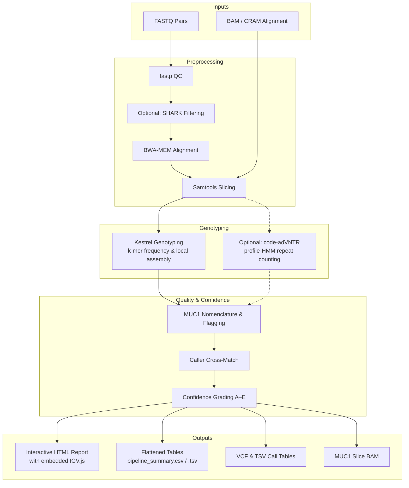

# VNtyper 2 - A Pipeline to genotype the MUC1-VNTR

[](https://github.com/hassansaei/VNtyper/actions/workflows/ci-tests.yml)
[](https://github.com/hassansaei/VNtyper/actions/workflows/docker-build.yml)
[](https://github.com/hassansaei/VNtyper/actions/workflows/ci-tests.yml)
[](https://pypi.org/project/vntyper/)
[](https://pypi.org/project/vntyper/)
[](LICENSE)
[](https://doi.org/10.5281/zenodo.19744166)
[](https://doi.org/10.64898/2026.05.27.26352937)
[](https://vntyper.org/)

**VNtyper 2** is an advanced pipeline designed to genotype MUC1 coding Variable Number Tandem Repeats (VNTR) in Autosomal Dominant Tubulointerstitial Kidney Disease (ADTKD-MUC1) using Short-Read Sequencing (SRS) data. This refactored version of VNtyper v1 integrates enhanced variant calling algorithms, robust logging mechanisms, and streamlined installation processes to provide researchers with a powerful tool for VNTR analysis.

> [!TIP]
> **No local setup needed?** Try [VNtyper-Online](https://vntyper.org/) for rapid browser-based analysis.  
> **Preprint:** Popp B, Saei H, et al. *VNtyper 2 enables open-access short-read genotyping of MUC1 VNTR variants in ADTKD at high-speed*. **medRxiv** (2026). [doi:10.64898/2026.05.27.26352937](https://doi.org/10.64898/2026.05.27.26352937).

---

[Features](#features) • [Installation](#installation) • [Usage](#usage) • [Architecture](#pipeline-architecture) • [Outputs](#outputs--results) • [Dependencies](#dependencies) • [Citations](#citations) • [License](#license--contributing)

---

## Features

- **Multi-Method Genotyping:** Mapping-free k-mer genotyping via Kestrel (local haplotype assembly), optional code-adVNTR profile-HMM repeat-unit validation, and optional SHARK read fishing for FASTQ data.
- **Evidence-Based Confidence & QC:** First-match, evidence-ranked confidence grades (A–E), automated caller cross-match concordance, and dedicated VNTR coverage QC statistics.
- **Interactive & Standard Outputs:** Self-contained interactive HTML report featuring an embedded offline IGV.js alignment browser, flattened tabular summaries (`pipeline_summary.csv` / `.tsv`), and standard VCF/TSV call tables.
- **Cohort Aggregation:** `vntyper cohort` aggregates multiple sample outputs into cohort summaries with allele call frequency metrics and configurable rarity thresholds.
- **Production Resilience:** Fault-tolerant resumption (`--resume`), atomic output publishing, and comprehensive audit logs (`pipeline.log`) with MD5 file checksums.

---

## Installation

VNtyper 2 uses modern Python packaging with `pyproject.toml` and can be installed via Conda/Mamba, container images, or `pip`.

### Conda / Mamba (Recommended)

Installing via Conda or Mamba provides the complete environment including external bioinformatics binaries (`bwa`, `samtools`, `fastp`, `bcftools`, and Java 11 for Kestrel):

```bash
git clone https://github.com/hassansaei/VNtyper.git
cd VNtyper
mamba env create -f conda/environment_vntyper.yml
conda activate vntyper
pip install -e .
```

For development and test suites: `pip install -e .[dev]`

### Docker & Apptainer (Zero-Setup)

Prebuilt images with all dependencies and bundled reference data are published to GitHub Packages (GHCR). See [Running with Docker & Apptainer](#2-running-with-docker--apptainer).

### Python Package (`pip`)

`pip install vntyper` installs the complete Python package, entry point scripts, and packaged assets directly from PyPI:

```bash
pip install vntyper
```

> [!NOTE]
> **Tool Scope:** The `report`, `cohort`, and `calibrate` subcommands are pure Python and work out-of-the-box immediately after `pip install`. The `pipeline` subcommand executes external bioinformatics binaries (`bwa`, `samtools`, `fastp`, `bcftools`, and Java 11 for Kestrel). When running `pipeline` from a `pip` installation, ensure these tools are installed in your `PATH` (e.g. via system packages, HPC environment modules, or an existing Conda environment).

### Reference Data Setup

Before running the pipeline locally, install the required human reference genomes and MUC1 target models:

```bash
vntyper install-references --output-dir /path/to/reference/
```

This downloads and verifies the pre-built reference bundle with SHA-256 checksums.

---

## Usage

VNtyper 2 offers multiple subcommands for end-to-end analysis:

- `pipeline` — Run the full genotyping pipeline on BAM, CRAM, or paired FASTQ files.
- `report` — Regenerate HTML and TSV reports from an existing run directory.
- `cohort` — Aggregate multiple run directories into a cohort summary with call frequencies.
- `install-references` — Download or build reference files and motif databases.
- `online` — Extract a MUC1 BAM slice and submit it to VNtyper-Online.
- `calibrate` — Extract, fit, or evaluate opt-in calibration profiles.

### 1. Running the Genotyping Pipeline

> [!IMPORTANT]
> - **Input / output separation**: Always keep `--output-dir` outside the input alignment directory (e.g., separate `inputs/` and `results/` trees).
> - **Artifact naming**: Internal artifact basenames are fixed to `output` (e.g., `summary_report.html`, `pipeline_summary.json`). To separate runs, use distinct `--output-dir` paths rather than `-n / --output-name`.

#### BAM Input

```bash
vntyper pipeline \
    --bam /data/inputs/sample.bam \
    --output-dir /data/results/sample/ \
    --threads 4 \
    --fast-mode
```

#### CRAM Input

Provide the matching reference FASTA for CRAM decompression:

```bash
vntyper pipeline \
    --cram /data/inputs/sample.cram \
    --reference-fasta /data/reference/genome.fa \
    --output-dir /data/results/sample/ \
    --threads 4 \
    --fast-mode
```

#### Paired-End FASTQ Input

```bash
vntyper pipeline \
    --fastq1 /data/inputs/sample_R1.fastq.gz \
    --fastq2 /data/inputs/sample_R2.fastq.gz \
    --output-dir /data/results/sample/ \
    --threads 4 \
    --fast-mode
```

#### Resuming an Interrupted Run

Use `--resume` to reuse completed stages from an earlier run directory:

```bash
vntyper pipeline --bam /data/inputs/sample.bam --output-dir /data/results/sample/ --threads 4 --resume
```

#### Optional Modules (adVNTR & SHARK)

- **adVNTR**: Enable profile-HMM genotyping with `--extra-modules advntr`.
- **SHARK**: Enable raw FASTQ k-mer filtering with `--extra-modules shark` (FASTQ inputs only).

### 2. Running with Docker & Apptainer

Docker image for VNtyper 2 is provided and can be pulled and used as follows. Released images are published to GHCR as `latest` (the newest release), the immutable `vX.Y.Z` and `X.Y.Z` tags naming one exact release, and the moving `X` and `X.Y` series tags. Pin `vX.Y.Z` for a reproducible run. The `main` tag is rolling and tracks the default branch. Docker Hub artifacts are legacy, frozen, and unsupported.

#### Docker

```bash
docker pull ghcr.io/hassansaei/vntyper:latest

docker run --user $(id -u):$(id -g) -w /opt/vntyper --rm \
    -v /local/inputs/:/opt/vntyper/input \
    -v /local/results/:/opt/vntyper/output \
    ghcr.io/hassansaei/vntyper:latest \
    vntyper pipeline \
    --bam /opt/vntyper/input/sample.bam \
    -o /opt/vntyper/output/sample/
```

> **Note:** Input and output must be separate host directories. Mounting the same directory to both input and output is rejected to prevent in-tree side effects.

#### Apptainer / Singularity

```bash
apptainer pull docker://ghcr.io/hassansaei/vntyper:latest

apptainer run --pwd /opt/vntyper \
    -B /local/inputs/:/opt/vntyper/input \
    -B /local/results/:/opt/vntyper/output \
    vntyper_latest.sif vntyper pipeline \
    --bam /opt/vntyper/input/sample.bam \
    -o /opt/vntyper/output/sample/
```

### 3. Additional Subcommands

- **Regenerate Reports:**
  ```bash
  vntyper report --output-dir /data/results/sample/
  ```
- **Cohort Analysis:**
  ```bash
  vntyper cohort \
      --input-dirs /data/results/sample1 /data/results/sample2 /data/results/sample3 \
      --output-dir /data/cohort_summary/ \
      --rare-allele-max-frequency 0.05
  ```
- **Online Submission:**
  ```bash
  vntyper online --bam /data/inputs/sample.bam --output-dir /data/results/online_submission/
  ```

---

## Pipeline Architecture

VNtyper 2 integrates multiple steps into a streamlined pipeline. The following is an overview of the steps involved:


```mermaid
flowchart TD
    subgraph Inputs
        A1[FASTQ Pairs]
        A2[BAM / CRAM Alignment]
    end

    subgraph Preprocessing
        B1[fastp QC]
        B2[Optional: SHARK Filtering]
        B3a[BWA-MEM Alignment]
        B3b[Samtools Slicing]
    end

    subgraph Genotyping
        C1[Kestrel Genotyping<br/>k-mer frequency & local assembly]
        C2[Optional: code-adVNTR<br/>profile-HMM repeat counting]
    end

    subgraph Quality & Confidence
        D1[MUC1 Nomenclature & Flagging]
        D2[Caller Cross-Match]
        D3[Confidence Grading A–E]
    end

    subgraph Outputs
        E1[Interactive HTML Report<br/>with embedded IGV.js]
        E2[Flattened Tables<br/>pipeline_summary.csv / .tsv]
        E3[VCF & TSV Call Tables]
        E4[MUC1 Slice BAM]
    end

    A1 --> B1 --> B2 --> B3a --> B3b
    A2 --> B3b
    B3b --> C1
    B3b -.-> C2
    C1 --> D1
    C2 -.-> D1
    D1 --> D2 --> D3
    D3 --> E1 & E2 & E3 & E4
```

1. **Pre-processing & QC:** Quality filtering (`fastp`), optional SHARK k-mer filtering, and targeted MUC1 alignment slicing.
2. **Kestrel Genotyping:** Mapping-free k-mer frequency counting and local haplotype assembly over the MUC1 VNTR.
3. **Optional adVNTR Genotyping:** Profile-HMM genotyping for independent repeat-unit validation.
4. **Nomenclature & Confidence Grading:** Canonical MUC1 nomenclature, evidence flags, caller cross-match concordance, and confidence grades (A–E).
5. **Report Generation:** Interactive HTML reports (with offline IGV.js), flattened CSV/TSV summaries, and standard VCF/TSV calls.

---

## Outputs & Results

After pipeline completion, `--output-dir` contains:

- **Reports & Summaries:**
  - `summary_report.html` — Interactive HTML report with sample QC, VNTR coverage statistics, confidence grade chip, caller results, and embedded IGV.js browser.
  - `pipeline_summary.json` — Machine-readable summary with complete parameter and execution provenance.
  - `pipeline_summary.csv` / `.tsv` — Flattened, single-row summary per run (when requested via `--summary-formats`).
  - `pipeline_summary_rows.tsv` — Flattened table with one row per detected variant call.
- **Variant Calls:**
  - `kestrel/output_indel.vcf.gz` (or `.vcf`) — Standard VCF containing Kestrel variant calls.
  - `kestrel/kestrel_result.tsv` — Detailed Kestrel calls and k-mer path depths.
  - `advntr/output_adVNTR.tsv` — adVNTR repeat-unit calls (when enabled).
- **Alignments & Logs:**
  - `fastq_bam_processing/output_sliced.bam` & `.bai` — MUC1-region BAM slice and index.
  - `pipeline.log` — Full audit log with timestamps and MD5 checksums.

---

## Dependencies

VNtyper 2 relies on several tools and Python libraries. Ensure that the following dependencies are available in your environment:

- **Python**: `>= 3.10` (tested on 3.10–3.13; Docker image uses Python 3.12)
- **External Binaries**: `bwa` (≥ 0.7.17), `samtools` (≥ 1.15), `fastp` (≥ 0.23), `bcftools` (≥ 1.15), `Java` (JRE ≥ 11)
- **Key Python Libraries**: `pandas`, `numpy`, `biopython`, `pysam`, `regex`, `jinja2`, `igv-reports`, `plotly`, `rfc8785`

All dependencies are pre-packaged in `conda/environment_vntyper.yml` and in our Docker containers.

> [!NOTE]
> VNtyper is for **research use only**. Documentation and guides: [https://hassansaei.github.io/VNtyper/](https://hassansaei.github.io/VNtyper/).

---

## Citations

If you use VNtyper 2 in your research, please cite:

- **VNtyper 2 & VNtyper-Online (Preprint):**  
  Popp B, Saei H, Teltsh O, et al. *VNtyper 2 enables open-access short-read genotyping of MUC1 VNTR variants in ADTKD at high-speed*. **medRxiv** (2026). [doi:10.64898/2026.05.27.26352937](https://doi.org/10.64898/2026.05.27.26352937)
  <details>
  <summary>BibTeX</summary>

  ```bibtex
  @article{popp2026vntyper2,
    title={VNtyper 2 enables open-access short-read genotyping of MUC1 VNTR variants in ADTKD at high-speed},
    author={Popp, Bernt and Saei, Hassan and Teltsh, Omri and Janou{\v{s}}ek, V{\'a}clav and P{\v{r}}istoupilov{\'a}, Anna and Vrback{\'a}, Alena and Hartmannov{\'a}, Hana and Kidd, Kendrah and Helmuth, Johannes and Bleyer, Anthony J and Wiesener, Michael and Fausch, Kathrin and Rowan, Colm and El Hassan, Elhussein and Clince, Michelle and Cavalleri, Gianpiero and Locher, Maurus and Eckardt, Kai-Uwe and Richter-Pechanska, Paulina and {ADTKD-Net Consortium} and Kmoch, Stanislav and Antignac, Corinne and Conlon, Peter and Dorval, Guillaume and {\v{Z}}ivn{\'a}, Martina},
    journal={medRxiv},
    pages={2026.05.27.26352937},
    year={2026},
    publisher={Cold Spring Harbor Laboratory Press},
    doi={10.64898/2026.05.27.26352937}
  }
  ```
  </details>

- **Original Method (VNtyper v1):**  
  Saei H, Morinière V, Heidet L, et al. *VNtyper enables accurate alignment-free genotyping of MUC1 coding VNTR using short-read sequencing data*. **iScience** 26(7):107171 (2023). [doi:10.1016/j.isci.2023.107171](https://doi.org/10.1016/j.isci.2023.107171)
  <details>
  <summary>BibTeX</summary>

  ```bibtex
  @article{saei2023vntyper,
    title={VNtyper enables accurate alignment-free genotyping of MUC1 coding VNTR using short-read sequencing data},
    author={Saei, Hassan and Morini{\`e}re, Vincent and Heidet, Laurence and others},
    journal={iScience},
    volume={26},
    number={7},
    pages={107171},
    year={2023},
    publisher={Elsevier},
    doi={10.1016/j.isci.2023.107171}
  }
  ```
  </details>

- **Underlying Tools & Archive:**
  - **Zenodo Archive**: Concept DOI [10.5281/zenodo.19744166](https://doi.org/10.5281/zenodo.19744166)
  - **Kestrel**: Audano PA, et al. *Bioinformatics* 34(10):1659–1665 (2018). [doi:10.1093/bioinformatics/btx753](https://doi.org/10.1093/bioinformatics/btx753)
  - **code-adVNTR**: Park J, et al. *iScience* 25(8):104785 (2022). [doi:10.1016/j.isci.2022.104785](https://doi.org/10.1016/j.isci.2022.104785)
  - **SHARK**: Denti L, et al. *Bioinformatics* 37(4):464–472 (2021). [doi:10.1093/bioinformatics/btaa779](https://doi.org/10.1093/bioinformatics/btaa779)

---

## License & Contributing

VNtyper is licensed under the [BSD 3-Clause License](LICENSE). Contributions are welcome; please see [CONTRIBUTING.md](CONTRIBUTING.md) and [AGENTS.md](AGENTS.md). For questions or issues, please open an [issue on GitHub](https://github.com/hassansaei/VNtyper/issues).
