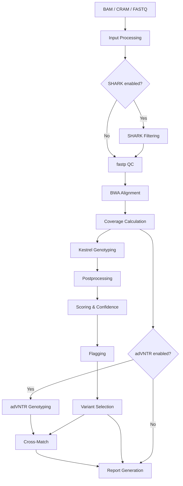

# Pipeline Overview

VNtyper 2 implements a multi-stage pipeline for genotyping MUC1 coding Variable Number Tandem Repeat (VNTR) variants associated with Autosomal Dominant Tubulointerstitial Kidney Disease (ADTKD-MUC1). The pipeline accepts BAM, CRAM, or paired-end FASTQ input and produces a genotyping result with confidence-annotated variant calls.

## Pipeline Architecture

## Pipeline Stages

### [Input Processing](input-processing.md)

Handles BAM/CRAM region extraction (MUC1 locus), FASTQ quality control via fastp, unmapped read recovery, and coverage calculation over the VNTR region. Detects reference assembly and alignment pipeline from BAM headers.

### [Kestrel Genotyping](kestrel.md)

The core genotyping engine. Kestrel performs mapping-free, k-mer-based variant calling against the MUC1 VNTR reference. The postprocessing pipeline filters, scores, and annotates variants through nine distinct steps. This is the most critical component of VNtyper.

### [Scoring and Confidence Assignment](scoring-and-confidence.md)

Calculates frame scores to identify frameshift mutations, computes depth-based confidence scores, and assigns precision labels (High_Precision*, High_Precision, Low_Precision, Negative) using empirically derived thresholds from Saei et al. (2023).

### [Flagging](flagging.md)

Applies configurable post-hoc empirical filters to flag potential false positives and duplicate variants. Flags are evaluated before variant selection so that unflagged variants are preferred.

### [Optional Modules](optional-modules.md)

Two optional modules provide complementary analyses: **adVNTR** (profile-HMM genotyping for independent validation) and **SHARK** (rapid MUC1 read extraction from large FASTQ datasets). Cross-matching logic compares Kestrel and adVNTR calls.

### [Report Generation](reports.md)

Produces an HTML report with variant summary tables, embedded IGV genome browser views, QC metrics, and screening interpretation. Cohort-level reports aggregate results across multiple samples with interactive Plotly charts.

## Reference

Saei H. et al., *iScience* 26, 107171 (2023). DOI: [10.1016/j.isci.2023.107171](https://doi.org/10.1016/j.isci.2023.107171)
