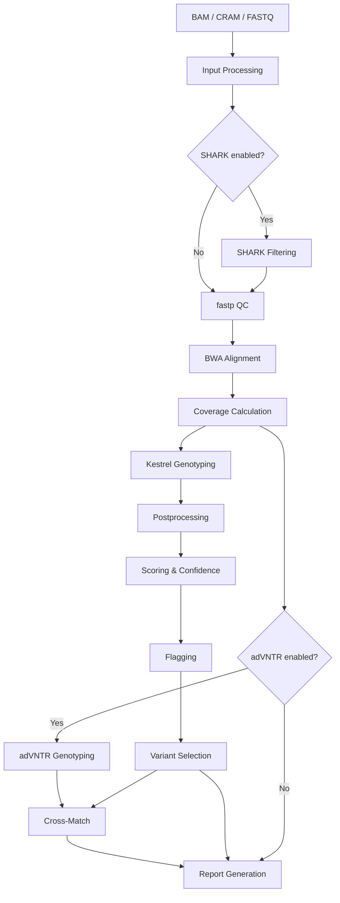

# Pipeline Overview

VNtyper genotypes the MUC1 coding Variable Number Tandem Repeat (VNTR) to diagnose ADTKD-MUC1 from short-read sequencing data. It accepts BAM, CRAM, or paired-end FASTQ inputs and outputs confidence-scored variant calls with an interactive HTML report.

## Pipeline Architecture

```mermaid
flowchart TD
    A[BAM / CRAM / FASTQ] --> B[Input Processing]
    B --> C{SHARK enabled?}
    C -->|Yes| D[SHARK Filtering]
    C -->|No| E[fastp QC]
    D --> E
    E --> F[BWA Alignment]
    F --> G[Coverage Calculation]
    G --> H[Kestrel Genotyping]
    H --> I[Postprocessing]
    I --> J[Scoring & Confidence]
    J --> K[Flagging]
    K --> L[Variant Selection]
    G --> M{adVNTR enabled?}
    M -->|Yes| N[adVNTR Genotyping]
    N --> O[Cross-Match]
    L --> O
    O --> P[Report Generation]
    L --> P
    M -->|No| P
```

## Pipeline Stages

### [Input Processing](input-processing.md)

Extracts the MUC1 target region from BAM or CRAM files, performs FASTQ quality control via fastp, recovers unmapped read pairs, and computes per-base coverage across the VNTR array. Detects reference assembly and alignment pipeline from BAM headers.

### [Kestrel Genotyping](kestrel.md)

Executes mapping-free, k-mer-based variant calling against the MUC1 VNTR reference sequence. Applies a nine-step postprocessing pipeline that filters, scores, and annotates candidate variants.

### [Scoring and Confidence Assignment](scoring-and-confidence.md)

Calculates frame scores to detect pathogenic reading-frame shifts (+1 mod 3), evaluates alternate k-mer-path depth ratios against the repeat array, and assigns confidence tiers (High_Precision*, High_Precision, Low_Precision, Negative) using calibrated thresholds.

### [Flagging](flagging.md)

Evaluates configurable boolean rule trees to tag false positives and recurrent artifacts. Evaluates flags before variant selection so unflagged candidates take precedence. Disqualifying artifact flags remove candidates prior to final selection.

### [Optional Modules](optional-modules.md)

Integrates complementary tools: adVNTR performs profile-HMM genotyping for independent orthogonal validation, and SHARK extracts MUC1-matching reads directly from unaligned whole-genome or whole-exome FASTQs. Cross-matching evaluates pairwise concordance between Kestrel and adVNTR calls.

### [Report Generation](reports.md)

Emits a self-contained HTML report featuring variant tables, screening interpretations, coverage QC metrics, and embedded IGV views. Generates multi-sample cohort summaries with interactive frequency tables and visualizations.

## Reference

Saei H. et al., *iScience* 26, 107171 (2023). DOI: [10.1016/j.isci.2023.107171](https://doi.org/10.1016/j.isci.2023.107171)
