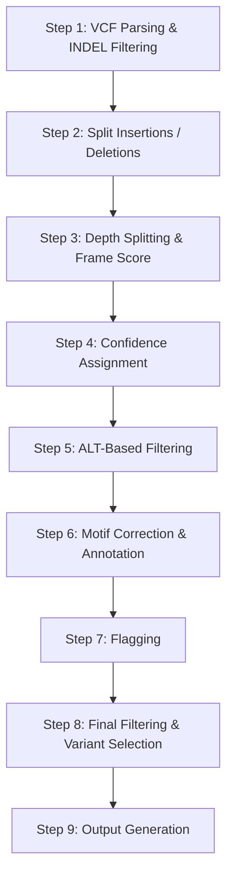

# Kestrel Genotyping

Kestrel is the primary genotyping engine in VNtyper. It performs mapping-free, k-mer-based variant calling against a MUC1 VNTR reference sequence. The postprocessing pipeline that follows is the most complex and critical component of VNtyper.

## Why Mapping-Free Genotyping?

!!! info "The VNTR alignment problem"
    Traditional read alignment struggles with VNTRs because the tandem repeat structure creates ambiguous mappings. A read carrying a frameshift insertion within one repeat unit may align equally well to multiple positions across the VNTR. Mapping-free approaches bypass this by analyzing k-mer frequency spectra directly, avoiding alignment-induced reference bias.

Kestrel builds a de Bruijn graph from k-mers extracted from the input reads, then identifies paths through the graph that differ from the reference. This enables detection of insertions and deletions within the repetitive MUC1 VNTR even when traditional aligners fail.

## Kestrel Parameters

| Parameter | Default | Description |
|-----------|---------|-------------|
| `kmer_sizes` | `[20]` | K-mer length for graph construction |
| `java_memory` | `12g` | JVM heap allocation |
| `max_align_states` | `60` | Maximum alignment states during path enumeration |
| `max_hap_states` | `60` | Maximum haplotype states for genotype resolution |
| `additional_settings` | `""` | Extra command-line flags passed to Kestrel |

These parameters are configured in `kestrel_config.json` under the `kestrel_settings` key.

## Kestrel Execution

The pipeline constructs a Java command invoking the Kestrel JAR:

```
java -Xmx12g -jar kestrel.jar -k 20 \
  --maxalignstates 60 --maxhapstates 60 \
  -r <muc1_reference.fa> -o output.vcf \
  -s<sample_name> R1.fastq.gz R2.fastq.gz \
  --hapfmt sam -p output.sam
```

Kestrel produces a VCF file with all detected variants and a SAM file of haplotype alignments. The SAM is converted to an indexed BAM for downstream IGV visualization.

## Postprocessing Pipeline

After Kestrel produces its raw VCF, VNtyper applies an eight-step postprocessing pipeline to filter, score, and annotate variants.



### Step 1: VCF Parsing and INDEL Filtering

The raw Kestrel VCF is filtered to retain only INDEL variants (insertions and deletions). SNVs are discarded because the pathogenic mechanism in ADTKD-MUC1 involves frameshift mutations within the VNTR coding sequence. The VCF format header is also corrected from `VCF4.2` to `VCFv4.2` for downstream tool compatibility.

If bcftools is available, the INDEL VCF is compressed and sorted (`output_indel.vcf.gz`) for efficient IGV visualization.

### Step 2: Split Insertions and Deletions

The INDEL VCF is split into two separate files: `output_insertion.vcf` and `output_deletion.vcf`. Each file is read into a pandas DataFrame for independent processing. Insertion and deletion DataFrames are merged with the MUC1 reference motif table to link each variant to its motif sequence, tagged as "Insertion" or "Deletion", and then combined into a single DataFrame.

### Step 3: Depth Splitting and Frame Score Calculation

The Kestrel `Sample` column (format: `DEL:AltDepth:ActiveRegionDepth`) is split into separate depth fields. The frame score is then calculated:

**Frame Score** = (len(ALT) - len(REF)) / 3

A boolean `is_frameshift` column is added: `True` when `(len(ALT) - len(REF)) % 3 != 0`. Only frameshift variants are relevant for ADTKD-MUC1. See [Scoring and Confidence](scoring-and-confidence.md) for details.

### Step 4: Confidence Assignment

Each variant receives a confidence label based on its depth score and alternate allele depth. The depth score is computed as `Alt_Depth / Active_Region_Depth`. Thresholds are derived from Saei et al. (2023). See [Scoring and Confidence](scoring-and-confidence.md) for threshold tables.

A **haplo_count** is also computed: the number of times the exact same variant (POS, REF, ALT) appears across different haplotype calls. Higher counts indicate more supporting evidence.

### Step 5: ALT-Based Filtering

Variants are filtered based on specific ALT allele patterns. Known artifact sequences (e.g., `CCGCC`, `CGGCG`, `CGGCC`) and certain motif combinations are excluded.

### Step 6: Motif Correction and Annotation

Each variant is annotated with its MUC1 repeat unit motif identity. The MUC1 VNTR consists of ~30-90 tandemly repeated units of approximately 60 bp each, designated by motif identifiers (e.g., X, Y, Z, 1, 2, 3, Q).

!!! info "MUC1 VNTR motif structure"
    The VNTR reference used by Kestrel encodes each repeat unit as a separate "chromosome" in the FASTA, named as `MotifLeft-MotifRight` (e.g., `X-Y`). A variant at position < 60 maps to the left motif; at position >= 60, it maps to the right motif. This convention allows VNtyper to determine which specific repeat unit harbors the variant.

Position-based filtering removes conserved motifs (Q, 8, 9, 7, 6p, 6, V, J, I, G, E, A) that rarely vary and are likely artifacts when called.

### Step 7: Flagging

Configurable empirical rules flag potential false positives. Flags are applied **before** variant selection (Issue #145 fix), ensuring that unflagged variants are preferred during the selection step. See [Flagging](flagging.md) for rule details.

### Step 8: Final Filtering and Variant Selection

Multiple boolean filter columns are evaluated:

- `is_frameshift` -- variant causes a frameshift
- `is_valid_frameshift` -- follows expected insertion (3n+1) or deletion (3n+2) pattern
- `depth_confidence_pass` -- confidence is not "Negative"
- `alt_filter_pass` -- passes ALT-value-specific filters
- `motif_filter_pass` -- passes motif annotation and position-based filters

Only variants where **all** applicable filters are `True` are retained. From the passing variants, a single best variant is selected using strict priority ordering:

1. Highest confidence level (High_Precision* > High_Precision > Low_Precision)
2. Unflagged preferred over flagged
3. Highest depth score
4. Highest haplo_count (number of identical variant calls across haplotypes)
5. Lowest genomic position (deterministic tie-breaker)

### Step 9: Output Generation

The final result is written to `kestrel_result.tsv` with metadata headers (VNtyper version, analysis date, reference file). A BED file (`output.bed`) is generated from the variant position for IGV visualization. An unfiltered pre-result file (`kestrel_pre_result.tsv`) is also saved for debugging.

## Reference

Saei H. et al., *iScience* 26, 107171 (2023). All thresholds and heuristics in the postprocessing pipeline are derived from this publication.
