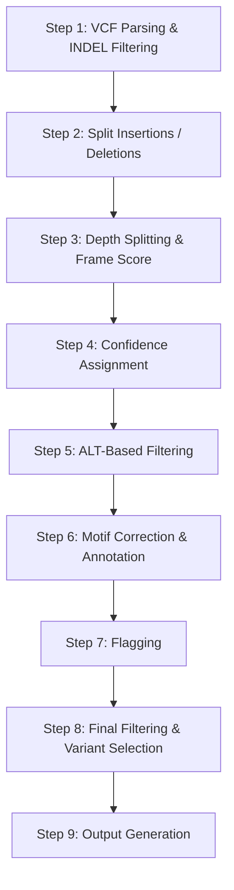

# Kestrel Genotyping

Kestrel is the primary genotyping engine in VNtyper 2. It performs mapping-free, k-mer-based variant calling against a MUC1 VNTR reference sequence. The postprocessing pipeline that follows is the most complex and critical component of VNtyper 2.

## Why Mapping-Free Genotyping?

!!! info "The VNTR alignment problem"
    Traditional read alignment struggles with VNTRs because the tandem repeat structure creates ambiguous mappings. A read carrying a frameshift insertion within one repeat unit may align equally well to multiple positions across the VNTR. Mapping-free approaches bypass this by analyzing k-mer frequency spectra directly, avoiding alignment-induced reference bias.

Kestrel scans ordered k-mer frequency spectra from the input reads, detecting regions where frequencies dip relative to their neighbors (active regions). Within each active region, it reconstructs local haplotypes by iteratively extending from high-frequency anchor k-mers using a modified Smith-Waterman alignment. Mismatches between reconstructed haplotypes and the reference identify insertions and deletions, even within highly repetitive VNTR sequences where traditional aligners fail.

## Kestrel Parameters

| Parameter | Default | Description |
|-----------|---------|-------------|
| `kmer_sizes` | `[20]` | K-mer length for graph construction |
| `java_memory` | `12g` | JVM heap allocation, applied to both steps |
| `max_align_states` | `40` | Maximum alignment states during path enumeration |
| `max_hap_states` | `40` | Maximum haplotype states for genotype resolution |
| `additional_settings` | `""` | Extra command-line flags appended to the calling step |
| `split_counting` | `true` | Count k-mers in a separate KAnalyze step (see below) |
| `keep_ikc` | `false` | Retain the attempt directory and its k-mer count after the run |
| `java_opts_count` | `""` | Extra JVM options for the counting step |
| `java_opts_call` | `-XX:+UseSerialGC` | Extra JVM options for the calling step |

These parameters are configured in `kestrel_config.json` under the `kestrel_settings` key.

!!! warning "`java_memory` is load-bearing"
    12g is not a round number picked for comfort. Lowering it to 4g measured *slower*
    overall with CPU time rising several-fold as G1 thrashed, and the counting step
    peaks near 7.7 GB at high thread counts. The observed peak RSS of one small run is
    not a reason to shrink it.

## Kestrel Execution

By default VNtyper runs Kestrel as **two commands per k-mer size**: a KAnalyze counting
step, then Kestrel itself reading the counts that step produced.

### Why counting is a separate step

Kestrel 1.0.1 builds a KAnalyze `CountModule` and configures almost nothing on it.
`KestrelRunnerBase.getCountModule()` sets the k-mer size, the temporary directory, the
post-count filter and the free-segment flag — but calls none of `setKmerThreadCount`,
`setSplitThreadCount` or `setThreads`, all three of which exist on that class. Counting
therefore runs at the compile-time defaults of one k-mer thread and one split thread,
and counting is the large majority of Kestrel's work on an unmapped-dominated input.

Running the bundled `kanalyze.jar` as its own step lets that work use the machine.
Kestrel accepts a pre-built indexed k-mer count (IKC) as input: `IkcCountMap.preModuleRun`
adopts a supplied `ikc` file, sets `rmLastTemp = false` — so Kestrel never deletes a
count file it was handed — and skips its own count module entirely.

```
# Step 1 - count, threaded
java -Xmx12g -jar kanalyze.jar count -k 20 \
  -c kmercount:5 --minsize 15 -m ikc \
  -d <kmer> -l <split> -t <sort> \
  --temploc <out>/kmer_20 -o <out>/kmer_20/kestrel_kmers.ikc \
  R1.fastq.gz R2.fastq.gz single.fastq.gz

# Step 2 - call, reading those counts
java -Xmx12g -XX:+UseSerialGC -jar kestrel.jar -k 20 \
  --maxalignstates 40 --maxhapstates 40 \
  -r <muc1_reference.fa> -o output.vcf \
  -s<sample_name> -f ikc <out>/kmer_20/kestrel_kmers.ikc \
  --hapfmt sam -p output.sam
```

The run's `--threads` budget is split across KAnalyze's three *concurrent* stages —
`-d` (k-mer), `-l` (split) and `-t` (sort). These are independent stages, not three
spellings of one worker count, so passing `--threads N` to all three would start
roughly 2.5N workers. The k-mer stage takes the largest share because it is the
measured bottleneck; every stage is floored at one worker.

The two steps use different JVM options because they have different shapes. Counting is
genuinely parallel and keeps the G1 default; calling is single-threaded, where G1 spawns
a GC worker per core against one application thread, so it uses `-XX:+UseSerialGC`.
`-XX:+UseParallelGC` is harmful on both and must not be used.

Kestrel produces a VCF file with all detected variants and a SAM file of haplotype alignments. The SAM is converted to an indexed BAM for downstream IGV visualization.

### Output layout and logs

Each k-mer attempt owns a directory, `<output>/kmer_<size>/`, rather than just a
filename — that makes a collision between two concurrent or retried attempts at the same
k structurally impossible, and makes cleanup one recursive removal. The counting step
writes its own log, `<output>/kanalyze_count_kmer_<size>.log`, kept separate from the
Kestrel log so that a counting failure's diagnostics are not overwritten by the calling
step's output.

The attempt directory is removed on every exit path — count failure, call failure and
success alike. Set `keep_ikc: true` to retain it when diagnosing a result; nothing else
will delete a count file Kestrel was handed. If the attempt directory already exists the
run **refuses to start**, rather than adopting it: the cleanup removes the whole
directory, so adopting one would delete data the run did not write.

Which path a run actually took is recorded in the pipeline summary as
`kestrel_counting_mode`, with the value `split` or `internal`.

### Turning the split off

`split_counting: false` restores the single-command path exactly. It is an operator
**kill switch, not a fallback**: nothing selects it automatically, and a failed counting
step raises rather than quietly re-running the work internally. An automatic fallback
would turn a broken counting step into a silently slower run, which is the failure mode
this codebase is least able to notice.

### `additional_settings` is an allowlist under the split

When Kestrel is handed a pre-built IKC, `additional_settings` accepts **only options
that provably cannot reach the k-mer counter**. Anything else raises a configuration
error before either command runs.

The reason is that once counting is a separate command, a count-affecting option has to
be applied to *both* commands or to neither. Kestrel validates only the k-size when it
reads an IKC — a same-k count file built with a different minimum count or minimizer
size is silently accepted and silently different, which moves `Depth_Score` and
therefore genotypes. A deny-list would be fail-open at exactly that boundary, so the
rule is an allowlist and a rejected option is a loud error the operator can see.

Rejected classes include counter-affecting options (`--mincount`, `--minsize`,
`--minmask`, `--charset`, `--seqfilter`, `--quality`, `-k`/`--ksize`, `--temploc`,
`--free`/`--nofree`, `--lib`/`--liburl`), the count-map selectors
(`--memcount`/`--nomemcount`), the IKC lifecycle flags (`--rmikc`/`--normikc`), and any
option whose value this builder already sets. So a setting such as `--mincount 3`, which
stock Kestrel would have accepted, now raises.

!!! note "If you need a count-affecting option"
    Set `kestrel_settings.split_counting: false`. That restores stock Kestrel's single
    command, where there is no second command to desynchronise from and the allowlist
    does not apply. The shipped default for `additional_settings` is `""`, so no shipped
    configuration is affected by the restriction.

## Postprocessing Pipeline

After Kestrel produces its raw VCF, VNtyper 2 applies a nine-step postprocessing pipeline to filter, score, and annotate variants.


```mermaid
flowchart TD
    S1[Step 1: VCF Parsing & INDEL Filtering] --> S2[Step 2: Split Insertions / Deletions]
    S2 --> S3[Step 3: Depth Splitting & Frame Score]
    S3 --> S4[Step 4: Confidence Assignment]
    S4 --> S5[Step 5: ALT-Based Filtering]
    S5 --> S6[Step 6: Motif Correction & Annotation]
    S6 --> S7[Step 7: Flagging]
    S7 --> S8[Step 8: Final Filtering & Variant Selection]
    S8 --> S9[Step 9: Output Generation]
```

### Step 1: VCF Parsing and INDEL Filtering

The raw Kestrel VCF is filtered to retain only INDEL variants (insertions and deletions). SNVs are discarded because the pathogenic mechanism in ADTKD-MUC1 involves frameshift mutations within the VNTR coding sequence. The VCF format header is also corrected from `VCF4.2` to `VCFv4.2` for downstream tool compatibility.

If bcftools is available, the INDEL VCF is compressed and sorted (`output_indel.vcf.gz`) for efficient IGV visualization.

### Step 2: Split Insertions and Deletions

The INDEL VCF is split into two separate files: `output_insertion.vcf` and `output_deletion.vcf`. Each file is read into a pandas DataFrame for independent processing. Insertion and deletion DataFrames are merged with the MUC1 reference motif table to link each variant to its motif sequence, tagged as "Insertion" or "Deletion", and then combined into a single DataFrame.

### Step 3: Depth Splitting and Frame Score Calculation

The Kestrel `Sample` column (format: `DEL:AltDepth:ActiveRegionDepth`) is split into separate depth fields. The frame score is then calculated:

**Frame Score** = (len(ALT) - len(REF)) / 3

A boolean `is_frameshift` column is added: `True` when `(len(ALT) - len(REF)) % 3 != 0`. Only frameshift variants are relevant for ADTKD-MUC1. See [Scoring and Confidence](scoring-and-confidence.md) for details.

### Step 4: Confidence Assignment

Each variant receives a confidence label based on its depth score and alternate allele depth. The depth score is computed as `Alt_Depth / Active_Region_Depth`. Thresholds are derived from Saei et al. (2023). See [Scoring and Confidence](scoring-and-confidence.md) for threshold tables.

A **haplo_count** is also computed: the number of times the exact same variant (POS, REF, ALT) appears across different haplotype calls. Higher counts indicate more supporting evidence.

### Step 5: ALT-Based Filtering

Variants are filtered based on specific ALT allele patterns. Known artifact sequences (e.g., `CCGCC`, `CGGCG`, `CGGCC`) and certain motif combinations are excluded.

### Step 6: Motif Correction and Annotation

Each variant is annotated with its MUC1 repeat unit motif identity. The MUC1 VNTR consists of ~30-90 tandemly repeated units of approximately 60 bp each, designated by motif identifiers (e.g., X, Y, Z, 1, 2, 3, Q).

!!! info "MUC1 VNTR motif structure"
    The VNTR reference used by Kestrel encodes junctions between adjacent repeat units as separate "chromosomes" in the FASTA, named as `MotifLeft-MotifRight` (e.g., `X-Y`). A variant at position < 60 falls in the first repeat unit's body and is annotated with the **right** motif name from the pair; a variant at position >= 60 falls in the second repeat unit and is annotated with the **left** motif name. This junction-based naming convention allows VNtyper 2 to map each variant to its specific repeat unit context.

Position-based filtering removes conserved motifs (Q, 8, 9, 7, 6p, 6, V, J, I, G, E, A) that rarely vary and are likely artifacts when called.

### Step 7: Flagging

Configurable empirical rules flag potential false positives. Flags are applied **before** variant selection (Issue #145 fix), ensuring that unflagged variants are preferred during the selection step. See [Flagging](flagging.md) for rule details.

### Step 8: Final Filtering and Variant Selection

Multiple boolean filter columns are evaluated:

- `is_frameshift` -- variant causes a frameshift
- `is_valid_frameshift` -- follows expected insertion (3n+1) or deletion (3n+2) pattern
- `depth_confidence_pass` -- confidence is not "Negative"
- `alt_filter_pass` -- passes ALT-value-specific filters
- `motif_filter_pass` -- passes motif annotation and position-based filters

Only variants where **all** applicable filters are `True` are retained. From the passing variants, a single best variant is selected using strict priority ordering:

1. Highest confidence level (High_Precision* > High_Precision > Low_Precision)
2. Unflagged preferred over flagged
3. Highest depth score
4. Highest haplo_count (number of identical variant calls across haplotypes)
5. Lowest genomic position (deterministic tie-breaker)

### Step 9: Output Generation

The final result is written to `kestrel_result.tsv` with metadata headers (VNtyper 2 version, analysis date, reference file). A BED file (`output.bed`) is generated from the variant position for IGV visualization. An unfiltered pre-result file (`kestrel_pre_result.tsv`) is also saved for debugging.

## Reference

Saei H. et al., *iScience* 26, 107171 (2023). All thresholds and heuristics in the postprocessing pipeline are derived from this publication.
