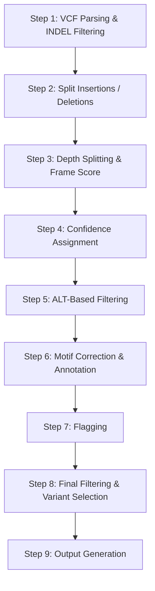

# Kestrel Genotyping

Kestrel is the primary genotyping engine in VNtyper. It performs mapping-free, k-mer-based variant calling against a MUC1 VNTR reference sequence. The downstream postprocessing pipeline filters, scores, and annotates candidate variants.

## Why Mapping-Free Genotyping?

!!! info "The VNTR alignment problem"
    Traditional read alignment struggles with VNTRs because tandem repeats create ambiguous alignments. A read carrying a frameshift insertion within one repeat unit may align equally well across multiple positions in the array. Mapping-free approaches bypass this by analyzing k-mer frequency spectra directly, avoiding reference alignment bias.

Kestrel scans ordered k-mer frequency spectra from input reads, detecting active regions where frequencies drop relative to flanking sequence. Within each active region, it reconstructs local haplotypes by iteratively extending from high-frequency anchor k-mers using a modified Smith-Waterman alignment. Mismatches between reconstructed haplotypes and the reference identify insertions and deletions.

## Kestrel Parameters

| Parameter | Default | Description |
|-----------|---------|-------------|
| `kmer_sizes` | `[20]` | K-mer length for graph construction |
| `java_memory` | `12g` | JVM heap allocation, applied to both steps |
| `max_align_states` | `40` | Maximum alignment states during path enumeration |
| `max_hap_states` | `40` | Maximum haplotype states for genotype resolution |
| `additional_settings` | `""` | Extra command-line flags appended to calling step |
| `split_counting` | `true` | Count k-mers in a separate KAnalyze step |
| `keep_ikc` | `false` | Retain attempt directory and k-mer count after run |
| `java_opts_count` | `""` | Extra JVM options for counting step |
| `java_opts_call` | `-XX:+UseSerialGC` | Extra JVM options for calling step |

These parameters are configured in `kestrel_config.json` under `kestrel_settings`.

!!! warning "`java_memory` is load-bearing"
    The 12g setting is calibrated for performance. Lowering it to 4g increases runtimes and CPU time several-fold due to G1 garbage collection thrashing. The counting step peaks near 7.7 GB at high thread counts. Peak RSS on a small run does not justify reducing this allocation.

## Kestrel Execution

VNtyper runs Kestrel by default as **two commands per k-mer size**: a threaded KAnalyze counting step, followed by Kestrel reading the pre-built counts.

### Why counting is a separate step

Kestrel 1.0.1 builds a KAnalyze `CountModule` without configuring thread counts. `KestrelRunnerBase.getCountModule()` sets the k-mer size, temporary directory, post-count filter, and free-segment flag, but leaves `setKmerThreadCount`, `setSplitThreadCount`, and `setThreads` at their single-threaded defaults. Counting represents most of Kestrel's runtime on unmapped-rich inputs.

Running the bundled `kanalyze.jar` as a distinct command enables multi-core execution. Kestrel natively accepts a pre-built indexed k-mer count (IKC) file: `IkcCountMap.preModuleRun` adopts the supplied `ikc` file, sets `rmLastTemp = false` (ensuring Kestrel never deletes the count file), and bypasses internal counting.

```
# Step 1: count, threaded
java -Xmx12g -jar kanalyze.jar count -k 20 \
  -c kmercount:5 --minsize 15 -m ikc \
  -d <kmer> -l <split> -t <sort> \
  --temploc <out>/kmer_20 -o <out>/kmer_20/kestrel_kmers.ikc \
  R1.fastq.gz R2.fastq.gz single.fastq.gz

# Step 2: call, reading counts
java -Xmx12g -XX:+UseSerialGC -jar kestrel.jar -k 20 \
  --maxalignstates 40 --maxhapstates 40 \
  -r <muc1_reference.fa> -o output.vcf \
  -s<sample_name> -f ikc <out>/kmer_20/kestrel_kmers.ikc \
  --hapfmt sam -p output.sam
```

The `--threads` allocation is partitioned across KAnalyze's three concurrent stages: `-d` (k-mer extraction), `-l` (split), and `-t` (sorting). These are distinct pipeline stages rather than redundant worker flags; assigning `--threads N` to all three would launch approximately 2.5N workers. The k-mer stage receives the largest allocation as the primary bottleneck. Each stage is floored at one worker.

JVM options differ between steps: counting is parallel and uses the default G1 collector, whereas calling is single-threaded and uses `-XX:+UseSerialGC` to prevent G1 from launching unnecessary GC threads. Parallel GC (`-XX:+UseParallelGC`) degrades performance on both steps.

Kestrel outputs a VCF file of detected variants and a SAM file containing one alignment record per resolved haplotype. The SAM file is converted to indexed `output.bam` for IGV visualization. These records represent resolved haplotype sequences rather than original reads. The optional `XD` tag records minimum k-mer depth for the haplotype; VNtyper records it separately and does not use it to weight votes.

### Output layout and logs

Each k-mer attempt writes to `<output>/kmer_<size>/`. Isolating runs in dedicated directories prevents collisions between concurrent attempts and enables clean recursive cleanup. The counting step writes to `<output>/kanalyze_count_kmer_<size>.log`, separated from the Kestrel log to preserve error diagnostics.

The attempt directory is removed upon exit across all outcomes (failure and success). Setting `keep_ikc: true` preserves the directory for debugging. If the directory already exists prior to running, the pipeline refuses to execute to prevent deleting external data.

The chosen execution path is recorded in `pipeline_summary.json` under `kestrel_counting_mode` as `split` or `internal`.

### Disabling split counting

Setting `split_counting: false` restores the single-command workflow. This setting is an operator kill switch, not an automated fallback: a failed counting step raises an exception rather than silently retrying internally.

### Allowlist for `additional_settings`

When using pre-built IKC counts, `additional_settings` permits only options that cannot alter k-mer counting. Any disallowed option raises a configuration error prior to execution.

When counting is split, count-modifying parameters must be applied to both commands. Kestrel validates only k-mer size when opening an IKC file; counts generated with differing minimum counts or minimizer sizes are accepted silently, altering depth scores and genotype calls.

Disallowed flags include counter options (`--mincount`, `--minsize`, `--minmask`, `--charset`, `--seqfilter`, `--quality`, `-k`/`--ksize`, `--temploc`, `--free`/`--nofree`, `--lib`/`--liburl`), count-map selectors (`--memcount`/`--nomemcount`), IKC lifecycle controls (`--rmikc`/`--normikc`), and options configured directly by VNtyper.

!!! note "Count-affecting settings"
    To configure count-affecting parameters, set `kestrel_settings.split_counting: false` to run stock single-command Kestrel.

## Postprocessing Pipeline

Following VCF generation, VNtyper applies a nine-step postprocessing pipeline:


```mermaid
flowchart TD
    S1[Step 1: VCF Parsing & INDEL Filtering] --> S2[Step 2: Split Insertions / Deletions]
    S2 --> S3[Step 3: Depth Splitting & Frame Score]
    S3 --> S4[Step 4: Confidence Assignment]
    S4 --> S5[Step 5: ALT-Based Filtering]
    S5 --> S6[Step 6: Motif Correction & Annotation]
    S6 --> S7[Step 7: Flagging]
    S7 --> S8[Step 8: Final Filtering & Variant Selection]
    S8 --> S9[Step 9: Output Generation]
```

### Step 1: VCF Parsing and INDEL Filtering

Filters the raw Kestrel VCF to retain only INDELs, discarding SNVs. Standardizes header format to `VCFv4.2`. If bcftools is available, compresses and indexes the VCF (`output_indel.vcf.gz`).

### Step 2: Split Insertions and Deletions

Splits INDELs into `output_insertion.vcf` and `output_deletion.vcf`. Loads each into pandas DataFrames, merges with the MUC1 reference motif table, annotates variant type, and recombines the records.

### Step 3: Depth Splitting and Frame Score Calculation

Splits the Kestrel `Sample` field (`DEL:AltDepth:ActiveRegionDepth`) into alternate-allele k-mer-path depth and total active-region k-mer depth. Calculates frame score:

**Frame Score** = (len(ALT) - len(REF)) / 3

Sets `is_frameshift = True` when `(len(ALT) - len(REF)) % 3 != 0`.

### Step 4: Confidence Assignment

Computes depth score (`Alt_Depth / Active_Region_Depth`) and assigns confidence labels (High_Precision*, High_Precision, Low_Precision, Negative) using calibrated thresholds. Calculates `haplo_count` (the frequency of identical POS, REF, ALT calls across reconstructed haplotypes).

### Step 5: ALT-Based Filtering

Filters out known false-positive sequence motifs (such as `CCGCC`, `CGGCG`, `CGGCC`) and incompatible motif pairings.

### Step 6: Motif Correction and Annotation

Annotates variants with MUC1 repeat unit identities (~60 bp motifs such as X, Y, Z, 1, 2, 3, Q).

!!! info "MUC1 VNTR motif structure"
    The reference FASTA encodes repeat unit junctions as paired entries (`MotifLeft-MotifRight`). Variants at position < 60 fall within the first repeat unit and receive the right-hand motif name; variants at position >= 60 fall within the second unit and receive the left-hand motif name.

Filters out variants within invariant motifs (Q, 8, 9, 7, 6p, 6, V, J, I, G, E, A) that represent sequencing artifacts.

### Step 7: Flagging

Applies configurable boolean rule trees to tag false positives and artifacts. Evaluated before variant selection so unflagged candidates take precedence.

### Step 8: Final Filtering and Variant Selection

Evaluates six boolean gate columns:

- `is_frameshift`: Must cause a reading-frame shift.
- `is_valid_frameshift`: Must follow insertion (3n+1) or deletion (3n+2) pathogenic signatures.
- `depth_confidence_pass`: Confidence must not be Negative.
- `alt_filter_pass`: Must pass ALT sequence filters.
- `motif_filter_pass`: Must pass motif position filters.
- `flag_filter_pass`: Must not carry any flag declared in `artifact_flags`.

Retains only rows where all gates evaluate to `True`. Selects the single best variant using deterministic priority ranking:

1. Highest confidence tier (High_Precision* > High_Precision > Low_Precision)
2. Unflagged preferred over flagged
3. Highest depth score
4. Highest haplo_count
5. Lowest genomic position (deterministic tie-breaker)

### Step 9: Output Generation

Writes final calls to `kestrel_result.tsv` with run metadata. Generates `output.bed` for IGV visualization. Retains unfiltered candidate rows in `kestrel_pre_result.tsv` for provenance.

## The Below-Reporting-Floor Note

A candidate variant that passes all structural gates but fails the depth score threshold is a valid pathogenic-frame variant below the calling floor. Under Issue #266, such variants trigger an informational `##` banner comment in `kestrel_result.tsv`:

```
## VNtyper Kestrel result
## VNtyper Version: 2.0.23
## Analysis date: 2026-08-26 21:59:44
## Reference file: reference/All_Pairwise_and_Self_Merged_MUC1_motifs_filtered.fa
## Subthreshold candidate: 4 candidate variants in the pathogenic frame identified below the
   reporting floor (best Depth_Score 0.0040072, floor 0.00469); filtered out and NOT a call.
   Depth_Score is a ratio against an active-region depth summed over the repeat array, so the
   same alternate k-mer-path depth scores lower on a longer allele.
```

The banner is strictly a comment line. `summary.parse_tsv` routes `#` lines into `comments`, leaving the 10-column result table unchanged. Downstream tools reading table rows do not register a call.

### Qualifying criteria

A candidate triggers the note only when every structural gate is `True` and `depth_confidence_pass` is explicitly `False`:

| Gate | Rationale for disqualification |
|------|--------------------------------|
| `is_frameshift`, `is_valid_frameshift` | Non-pathogenic reading frames are not disease candidates. |
| `alt_filter_pass` | Excluded ALT patterns represent known technical noise. |
| `motif_filter_pass` | Non-target motif regions are excluded from calling. |
| `flag_filter_pass` | Artifact flags represent deliberate exclusions (Issue #174); strong artifact signals must not be mislabeled as subthreshold true signal. |

Missing, blank, or non-boolean verdicts disqualify a row.

### Occurrence profile

The note appears exclusively on samples where no variant was called. On the 400-sample benchmark cohort (200 carriers, 200 controls):

| Sample Group | Total | Samples with subthreshold note |
|--------------|-------|-------------------------------|
| False negatives | 22 | 22 |
| True negatives | 200 | 1 |
| Called samples | 178 | 0 |

Positive calls suppress the note to avoid displaying redundant sub-optimal descriptions of the called variant.

### Operational boundaries

The reporting floor remains unchanged at `0.00469`. A subthreshold candidate is not a call. The report marks the screening state as `negative_subthreshold`, categorized as a non-finding under `algorithm_logic.kestrel.non_finding_results` in `report_config.json`. Cohort analysis classifies the sample as `Negative`.

Depth score is a ratio against active-region depth summed over the repeat array. A mutant unit among N repeat copies scores approximately 1/N regardless of sequencing depth; identical alternate k-mer depths yield lower scores in longer repeat arrays.

To disable the note, set `subthreshold_note.enabled: false` in `kestrel_config.json`.

## Reference

Saei H. et al., *iScience* 26, 107171 (2023).
