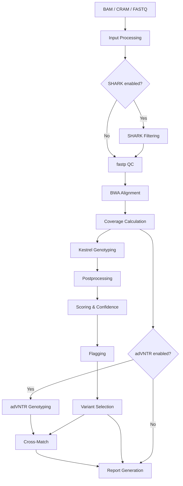

# VNtyper MkDocs Documentation Site — Implementation Plan

> **For agentic workers:** REQUIRED: Use superpowers:subagent-driven-development (if subagents available) or superpowers:executing-plans to implement this plan. Steps use checkbox (`- [ ]`) syntax for tracking.

**Goal:** Create a professional, comprehensive MkDocs Material documentation site for VNtyper 2.0, deployed to GitHub Pages, covering installation, CLI reference, pipeline methods, configuration, and scientific background.

**Architecture:** MkDocs with Material theme, all content in `docs/` directory with a single `mkdocs.yml` config at the repo root. GitHub Actions workflow deploys to `gh-pages` branch on push to `main`. Content is organized into 6 navigation tabs: Home, Getting Started, User Guide, CLI Reference, Pipeline & Methods, and About. Existing README/CONTRIBUTING content is migrated and expanded, not duplicated.

**Tech Stack:** MkDocs 1.6+, mkdocs-material 9.5+, pymdown-extensions, mkdocs-minify-plugin, GitHub Actions for deployment

---

## File Structure

```
VNtyper/
├── mkdocs.yml                              # MkDocs configuration (single config file)
├── docs/
│   ├── index.md                            # Landing page (hero + quick overview)
│   ├── getting-started/
│   │   ├── index.md                        # Getting started overview
│   │   ├── installation.md                 # pip, conda, Docker, from source
│   │   ├── quickstart.md                   # 5-minute working example
│   │   └── reference-setup.md             # Installing reference files
│   ├── user-guide/
│   │   ├── index.md                        # User guide overview
│   │   ├── input-formats.md               # BAM/CRAM/FASTQ requirements
│   │   ├── running-pipeline.md            # Full pipeline walkthrough
│   │   ├── output-files.md                # Output directory structure & interpretation
│   │   ├── configuration.md               # config.json & kestrel_config.json reference
│   │   ├── reference-assemblies.md        # hg19/hg38/GRCh37/GRCh38 guide
│   │   ├── docker.md                      # Docker & Apptainer usage
│   │   ├── cohort-analysis.md             # Multi-sample aggregation
│   │   ├── online-mode.md                 # vntyper.org web submission
│   │   └── snakemake.md                   # Batch processing with Snakemake
│   ├── cli/
│   │   ├── index.md                        # CLI overview + global options
│   │   ├── pipeline.md                     # vntyper pipeline
│   │   ├── install-references.md          # vntyper install-references
│   │   ├── report.md                      # vntyper report
│   │   ├── cohort.md                      # vntyper cohort
│   │   └── online.md                      # vntyper online
│   ├── pipeline/
│   │   ├── index.md                        # Pipeline architecture overview + Mermaid diagram
│   │   ├── input-processing.md            # BAM/CRAM extraction, QC, coverage
│   │   ├── kestrel.md                     # Kestrel genotyping + postprocessing
│   │   ├── scoring-and-confidence.md      # Frame scoring, depth scores, confidence
│   │   ├── flagging.md                    # Variant flagging rules
│   │   ├── optional-modules.md            # adVNTR & SHARK
│   │   └── reports.md                     # Report generation & IGV
│   ├── about/
│   │   ├── index.md                        # About the project
│   │   ├── scientific-background.md       # MUC1-VNTR biology, ADTKD
│   │   ├── citation.md                    # How to cite, BibTeX
│   │   ├── changelog.md                   # Version history
│   │   ├── contributing.md                # Contributing guide (migrated)
│   │   ├── faq.md                         # Frequently asked questions
│   │   └── license.md                     # License text
│   ├── assets/
│   │   └── stylesheets/
│   │       └── extra.css                  # Custom CSS overrides (minimal)
│   └── overrides/
│       └── main.html                      # Template override for footer/announcements
└── .github/
    └── workflows/
        └── docs.yml                       # GitHub Actions deployment workflow
```

**Key design decisions:**
- **5 nav tabs + Home** — top-level items become tabs; Home is the site title link
- **`docs/superpowers/`** already exists in the docs directory — leave it untouched; MkDocs only serves files referenced in `nav:`
- **`index.md` per section** enables Material's navigation.indexes feature (section landing pages)
- **CLI reference is separate from User Guide** — reference vs. tutorial distinction
- **Pipeline & Methods tab** serves the scientific audience
- **About tab** collects meta-content (citation, contributing, FAQ, changelog)
- **No mkdocstrings/API docs** — the CLI is the public interface, not the Python API
- **Existing docs (README, CONTRIBUTING, docker/README)** are migrated into the site, not symlinked

---

## Chunk 1: Project Setup & Configuration

### Task 1: Add MkDocs dependencies to pyproject.toml

**Files:**
- Modify: `pyproject.toml`

- [ ] **Step 1: Add docs optional dependency group**

Add a `[project.optional-dependencies]` docs group in `pyproject.toml`:

```toml
[project.optional-dependencies]
dev = [
    # ... existing dev deps ...
]
docs = [
    "mkdocs>=1.6,<2",
    "mkdocs-material>=9.5,<10",
    "pymdown-extensions>=10.0",
    "mkdocs-minify-plugin>=0.8",
]
```

- [ ] **Step 2: Add Makefile targets for docs**

Add to `Makefile` after the existing targets:

```makefile
## Documentation
.PHONY: docs-install docs-serve docs-build docs-deploy docs-clean

docs-install: ## Install documentation dependencies
	pip install -e .[docs]

docs-serve: ## Serve docs locally with live reload
	mkdocs serve

docs-build: ## Build static documentation site
	mkdocs build --strict

docs-deploy: ## Deploy docs to GitHub Pages
	mkdocs gh-deploy --force

docs-clean: ## Remove built documentation
	rm -rf site/
```

- [ ] **Step 3: Verify installation**

Run: `pip install -e .[docs]`
Expected: MkDocs and Material theme install successfully

Run: `mkdocs --version`
Expected: Version 1.6+

- [ ] **Step 4: Commit**

```bash
git add pyproject.toml Makefile
git commit -m "build: add MkDocs Material documentation dependencies"
```

---

### Task 2: Create mkdocs.yml configuration

**Files:**
- Create: `mkdocs.yml`

- [ ] **Step 1: Write mkdocs.yml**

```yaml
site_name: VNtyper
site_url: https://hassansaei.github.io/VNtyper/
site_description: >-
  Genotyping MUC1 coding VNTRs for ADTKD-MUC1 diagnosis
  using short-read sequencing data.
site_author: Hassan Saei, Bernt Popp
repo_url: https://github.com/hassansaei/VNtyper
repo_name: hassansaei/VNtyper
edit_uri: edit/main/docs/

copyright: Copyright &copy; 2023–2026 Hassan Saei, Bernt Popp

theme:
  name: material
  custom_dir: docs/overrides
  features:
    - navigation.tabs
    - navigation.tabs.sticky
    - navigation.instant
    - navigation.instant.prefetch
    - navigation.top
    - navigation.path
    - navigation.indexes
    - content.code.copy
    - content.code.annotate
    - content.tabs.link
    - search.suggest
    - search.highlight
  palette:
    - media: "(prefers-color-scheme: light)"
      scheme: default
      primary: teal
      accent: teal
      toggle:
        icon: material/brightness-7
        name: Switch to dark mode
    - media: "(prefers-color-scheme: dark)"
      scheme: slate
      primary: teal
      accent: teal
      toggle:
        icon: material/brightness-4
        name: Switch to light mode

plugins:
  - search
  - minify:
      minify_html: true

markdown_extensions:
  - admonition
  - pymdownx.details
  - pymdownx.superfences:
      custom_fences:
        - name: mermaid
          class: mermaid
          format: !!python/name:pymdownx.superfences.fence_mermaid
  - pymdownx.tabbed:
      alternate_style: true
  - pymdownx.highlight:
      anchor_linenums: true
      line_spans: __span
      pygments_lang_class: true
  - pymdownx.inlinehilite
  - pymdownx.snippets
  - pymdownx.mark
  - pymdownx.keys
  - attr_list
  - md_in_html
  - def_list
  - tables
  - toc:
      permalink: true

extra:
  social:
    - icon: fontawesome/brands/github
      link: https://github.com/hassansaei/VNtyper
  generator: false

extra_css:
  - assets/stylesheets/extra.css

nav:
  - Home: index.md
  - Getting Started:
    - getting-started/index.md
    - Installation: getting-started/installation.md
    - Quick Start: getting-started/quickstart.md
    - Reference Setup: getting-started/reference-setup.md
  - User Guide:
    - user-guide/index.md
    - Input Formats: user-guide/input-formats.md
    - Running the Pipeline: user-guide/running-pipeline.md
    - Output Files: user-guide/output-files.md
    - Configuration: user-guide/configuration.md
    - Reference Assemblies: user-guide/reference-assemblies.md
    - Docker & Containers: user-guide/docker.md
    - Cohort Analysis: user-guide/cohort-analysis.md
    - Online Mode: user-guide/online-mode.md
    - Snakemake Workflows: user-guide/snakemake.md
  - CLI Reference:
    - cli/index.md
    - pipeline: cli/pipeline.md
    - install-references: cli/install-references.md
    - report: cli/report.md
    - cohort: cli/cohort.md
    - online: cli/online.md
  - Pipeline & Methods:
    - pipeline/index.md
    - Input Processing: pipeline/input-processing.md
    - Kestrel Genotyping: pipeline/kestrel.md
    - Scoring & Confidence: pipeline/scoring-and-confidence.md
    - Variant Flagging: pipeline/flagging.md
    - Optional Modules: pipeline/optional-modules.md
    - Reports & Visualization: pipeline/reports.md
  - About:
    - about/index.md
    - Scientific Background: about/scientific-background.md
    - Citation: about/citation.md
    - Changelog: about/changelog.md
    - Contributing: about/contributing.md
    - FAQ: about/faq.md
    - License: about/license.md
```

- [ ] **Step 2: Create extra.css**

```css
/* docs/assets/stylesheets/extra.css */
/* Minimal overrides — Material theme defaults are excellent */

/* Slightly wider content area for code blocks */
.md-grid {
  max-width: 1440px;
}
```

- [ ] **Step 3: Create template override for footer**

```html
<!-- docs/overrides/main.html -->
<!-- Update or remove this banner when no longer relevant -->



  VNtyper 2.0 is now available!
  <a href="about/changelog/">See what's new</a>

```

Note: `custom_dir: docs/overrides` is already included in the `mkdocs.yml` from Step 1. No logo/favicon is set — Material's default icon is used until a logo is added.

- [ ] **Step 4: Verify config is valid**

Run: `mkdocs build --strict 2>&1 | head -5`
Expected: Will fail because docs pages don't exist yet — that's expected. Check that there are no YAML syntax errors in the output.

- [ ] **Step 5: Commit**

```bash
git add mkdocs.yml docs/assets/stylesheets/extra.css docs/overrides/main.html
git commit -m "build: add MkDocs Material configuration with nav structure"
```

---

### Task 3: Create GitHub Actions docs deployment workflow

**Files:**
- Create: `.github/workflows/docs.yml`

- [ ] **Step 1: Write the workflow**

```yaml
# .github/workflows/docs.yml
name: Deploy Documentation

on:
  push:
    branches: [main]
    paths:
      - 'docs/**'
      - 'mkdocs.yml'
      - '.github/workflows/docs.yml'
  workflow_dispatch:

permissions:
  contents: write

jobs:
  deploy:
    runs-on: ubuntu-latest
    steps:
      - uses: actions/checkout@v4

      - uses: actions/setup-python@v5
        with:
          python-version: '3.12'
          cache: pip

      - name: Install dependencies
        run: pip install "mkdocs-material>=9.5" "pymdown-extensions>=10.0" "mkdocs-minify-plugin>=0.8"

      - name: Build and deploy
        run: mkdocs gh-deploy --force
```

- [ ] **Step 2: Commit**

```bash
git add .github/workflows/docs.yml
git commit -m "ci: add GitHub Actions workflow for docs deployment"
```

---

## Chunk 2: Home & Getting Started Pages

### Task 4: Create the landing page

**Files:**
- Create: `docs/index.md`

- [ ] **Step 1: Write the landing page**

The landing page should be a concise hero section with:
- One-paragraph description of VNtyper
- Key features as a grid (3 columns: Kestrel genotyping, Multi-assembly support, HTML reports)
- Quick install command
- Links to Quick Start and CLI Reference

```markdown
---
hide:
  - navigation
  - toc
---

# VNtyper 2.0

**Genotype MUC1 coding VNTRs for ADTKD-MUC1 diagnosis using short-read sequencing.**

VNtyper is a bioinformatics pipeline that detects frameshift mutations in the MUC1
Variable Number Tandem Repeat (VNTR) region — the genetic cause of Autosomal Dominant
Tubulointerstitial Kidney Disease (ADTKD-MUC1). It combines mapping-free k-mer
genotyping (Kestrel) with optional Profile-HMM validation (adVNTR) to deliver
confidence-scored variant calls from BAM, CRAM, or FASTQ input.

<div class="grid cards" markdown>

-   :material-dna:{ .lg .middle } **Mapping-Free Genotyping**

    ---

    Kestrel's k-mer approach avoids reference bias in repetitive VNTR regions,
    with empirically validated confidence scoring.

    [:octicons-arrow-right-24: How it works](pipeline/kestrel.md)

-   :material-file-multiple:{ .lg .middle } **Flexible Input**

    ---

    Accepts BAM, CRAM, or paired-end FASTQ files with support for hg19, hg38,
    GRCh37, and GRCh38 assemblies.

    [:octicons-arrow-right-24: Input formats](user-guide/input-formats.md)

-   :material-chart-bar:{ .lg .middle } **Interactive Reports**

    ---

    HTML reports with embedded IGV genome browser, coverage charts,
    and cohort-level summaries with optional pseudonymization.

    [:octicons-arrow-right-24: Output guide](user-guide/output-files.md)

</div>

## Quick Install

```bash
pip install vntyper
vntyper install-references -d ./references
vntyper pipeline --bam sample.bam -o results/
```

[:octicons-rocket-24: Get started](getting-started/quickstart.md){ .md-button .md-button--primary }
[:octicons-book-24: CLI Reference](cli/index.md){ .md-button }
```

- [ ] **Step 2: Commit**

```bash
git add docs/index.md
git commit -m "docs: add landing page"
```

---

### Task 5: Create Getting Started section

**Files:**
- Create: `docs/getting-started/index.md`
- Create: `docs/getting-started/installation.md`
- Create: `docs/getting-started/quickstart.md`
- Create: `docs/getting-started/reference-setup.md`

- [ ] **Step 1: Write getting-started/index.md**

```markdown
# Getting Started

New to VNtyper? Start here.

1. **[Installation](installation.md)** — Install VNtyper via pip, conda, or Docker
2. **[Quick Start](quickstart.md)** — Run your first analysis in 5 minutes
3. **[Reference Setup](reference-setup.md)** — Download required reference files
```

- [ ] **Step 2: Write getting-started/installation.md**

Content should cover four installation methods using Material's content tabs:

- **pip** (recommended): `pip install vntyper`
- **From source**: `git clone` + `pip install -e .`
- **Conda**: environment YAML setup
- **Docker**: `docker pull saei/vntyper:latest`

Include a **Prerequisites** section listing: Python 3.9+, Java 11+, BWA, samtools, fastp.

Include a **Verify Installation** section:
```bash
vntyper --version
```

Use `!!! warning` admonition for: "External tools (BWA, samtools, fastp, Java 11) must be installed separately. The Docker image includes all dependencies."

Source content from: `README.md` lines covering installation, `CONTRIBUTING.md` development setup section, `docker/README.md` Docker pull commands.

- [ ] **Step 3: Write getting-started/quickstart.md**

A complete 5-minute walkthrough:

1. Install VNtyper
2. Install references (`vntyper install-references -d ./references`)
3. Run on example BAM (`vntyper pipeline --bam sample.bam -o results/ --threads 4`)
4. View results (`results/kestrel/kestrel_result.tsv`)
5. Generate report (`vntyper report -o results/ --input-dir results/`)

Use `!!! tip` for: "Don't have a BAM file? Use the test data: `make download-test-data`"

Include expected output snippets showing what success looks like.

- [ ] **Step 4: Write getting-started/reference-setup.md**

Cover the `install-references` workflow:

- What references are needed and why
- Basic command: `vntyper install-references -d /path/to/refs`
- Choosing assemblies: `--references hg19 hg38`
- Choosing aligners: `--aligners bwa bwa-mem2`
- Skip indexing: `--skip-indexing`
- Expected output directory structure
- Storage requirements (~2GB)

Source from: `README.md` reference installation section, `install_references_config.json`.

- [ ] **Step 5: Verify pages render**

Run: `mkdocs serve`
Expected: Site loads at `http://127.0.0.1:8000` with Getting Started tab visible

- [ ] **Step 6: Commit**

```bash
git add docs/getting-started/
git commit -m "docs: add Getting Started section (install, quickstart, references)"
```

---

## Chunk 3: User Guide Pages

### Task 6: Create User Guide section

**Files:**
- Create: `docs/user-guide/index.md`
- Create: `docs/user-guide/input-formats.md`
- Create: `docs/user-guide/running-pipeline.md`
- Create: `docs/user-guide/output-files.md`
- Create: `docs/user-guide/configuration.md`
- Create: `docs/user-guide/reference-assemblies.md`
- Create: `docs/user-guide/docker.md`
- Create: `docs/user-guide/cohort-analysis.md`
- Create: `docs/user-guide/online-mode.md`
- Create: `docs/user-guide/snakemake.md`

- [ ] **Step 1: Write user-guide/index.md**

Brief overview linking to each page in the section. One sentence per page.

- [ ] **Step 2: Write user-guide/input-formats.md**

Cover:
- BAM files: requirements (sorted, indexed, which regions), validation checks VNtyper performs
- CRAM files: same as BAM + reference FASTA needed
- FASTQ files: paired-end required, gzipped supported, naming conventions
- Use content tabs to show BAM vs CRAM vs FASTQ side by side
- Include `!!! note` about SHARK module only working with FASTQ

Source from: `cli.py` argument validation logic, `fastq_bam_processing.py` validation functions.

- [ ] **Step 3: Write user-guide/running-pipeline.md**

Full walkthrough of `vntyper pipeline` with progressive examples:

1. **Minimal example**: `vntyper pipeline --bam sample.bam -o results/`
2. **With options**: adding `--threads`, `--fast-mode`, `--reference-assembly hg38`
3. **With adVNTR**: adding `--extra-modules advntr`
4. **With SHARK**: FASTQ mode with `--extra-modules shark`
5. **Custom regions**: `--custom-regions` and `--bed-file`
6. **Archiving results**: `--archive-results --archive-format tar.gz`

Each example should explain when/why you'd use those options.

Source from: `cli.py` pipeline subcommand, `README.md` usage section.

- [ ] **Step 4: Write user-guide/output-files.md**

Document the complete output directory tree:

```
results/
├── kestrel/
│   ├── kestrel_result.tsv      ← Main result file
│   ├── output_indel.vcf.gz     ← Filtered VCF
│   └── output.bam              ← Kestrel alignments
├── fastq_bam_processing/
├── alignment_processing/
├── coverage/
├── advntr/                     (if enabled)
├── pipeline_summary.json
└── summary_report.html
```

For `kestrel_result.tsv`, document every column with type, example value, and meaning. Use a table.

Explain confidence levels: High_Precision*, High_Precision, Low_Precision, Negative — what they mean clinically.

Source from: `pipeline.py` output structure, `kestrel_genotyping.py` column definitions.

- [ ] **Step 5: Write user-guide/configuration.md**

Document both config files using code blocks with annotations:

1. `config.json` — key sections: default_values, reference_data, tools, bam_processing, thresholds
2. `kestrel_config.json` — kestrel_settings, confidence_assignment, motif_filtering, flagging_rules

Use `!!! warning` for: "Modifying confidence thresholds changes variant sensitivity/specificity. The defaults are empirically validated."

Show how to use `--config-path` to override.

Source from: `vntyper/config.json`, `vntyper/scripts/kestrel_config.json`.

- [ ] **Step 6: Write user-guide/reference-assemblies.md**

Create a reference table of supported assemblies:

| Name | Convention | Chromosome Format | Example |
|------|-----------|-------------------|---------|
| hg19 | UCSC | chr1 | chr1:155158000-155163000 |
| hg38 | UCSC | chr1 | chr1:155184000-155194000 |
| GRCh37 | NCBI | 1 | 1:155158000-155163000 |
| ... | ... | ... | ... |

Explain auto-detection from BAM headers. Cover when to use `--reference-assembly` explicitly.

Source from: `reference_registry.py`, `region_utils.py`, `config.json` bam_processing.assemblies.

- [ ] **Step 7: Write user-guide/docker.md**

Migrate and expand from `docker/README.md`:
- Pulling pre-built images (Docker Hub + GHCR)
- Building from source
- Running the pipeline in Docker (volume mounts, permissions)
- Apptainer/Singularity conversion
- Health checks

Use content tabs for Docker vs Apptainer commands.

- [ ] **Step 8: Write user-guide/cohort-analysis.md**

Cover `vntyper cohort`:
- Input: list of directories or input file
- Pseudonymization: `--pseudonymize-samples`
- Output formats: HTML + CSV/TSV/JSON
- Example with 3 samples
- What the cohort report contains

Source from: `cli.py` cohort subcommand, `cohort_summary.py`.

- [ ] **Step 9: Write user-guide/online-mode.md**

Cover `vntyper online`:
- What it does (submit to vntyper.org)
- When to use it (no local tools installed, quick analysis)
- Usage with `--email` for notifications
- Resuming jobs with `--resume`
- Cohort submission with `--cohort-id`

Source from: `cli.py` online subcommand, `online_mode.py`.

- [ ] **Step 10: Write user-guide/snakemake.md**

Cover batch processing:
- Creating `bams.txt` input file
- Running the Snakemake workflow
- Cluster/cloud execution with `--profile`
- Expected output structure

Source from: `snakemake/vntyper2.smk`.

- [ ] **Step 11: Verify all pages render**

Run: `mkdocs serve`
Expected: User Guide tab shows all 9 pages in sidebar, content renders correctly

- [ ] **Step 12: Commit**

```bash
git add docs/user-guide/
git commit -m "docs: add User Guide section (10 pages)"
```

---

## Chunk 4: CLI Reference Pages

### Task 7: Create CLI Reference section

**Files:**
- Create: `docs/cli/index.md`
- Create: `docs/cli/pipeline.md`
- Create: `docs/cli/install-references.md`
- Create: `docs/cli/report.md`
- Create: `docs/cli/cohort.md`
- Create: `docs/cli/online.md`

- [ ] **Step 1: Write cli/index.md**

Overview page:
- How VNtyper CLI works (subcommand structure)
- Global options table: `-l/--log-level`, `-f/--log-file`, `-v/--version`, `--config-path`
- Quick reference showing all subcommands in a table
- Note: "Arguments can be placed before or after the subcommand"

- [ ] **Step 2: Write cli/pipeline.md**

Complete reference for `vntyper pipeline`. Structure as:

**Synopsis:**
```
vntyper pipeline [--bam FILE | --cram FILE | --fastq1 FILE --fastq2 FILE]
                 [-o DIR] [-n NAME] [-s SAMPLE] [--threads N]
                 [--reference-assembly ASSEMBLY] [--fast-mode]
                 [--extra-modules MODULE ...] [options]
```

Then document every argument in grouped tables:
1. Input Options (mutually exclusive group)
2. Output Options
3. Reference & Region Options
4. Processing Options
5. Optional Modules
6. Archiving Options

Each argument: flag, type, default, description.

End with 4-5 complete usage examples with explanatory text.

Source from: `cli.py` pipeline subparser (every `add_argument` call). The synopsis above is abbreviated — document ALL arguments including `--keep-intermediates`, `--delete-intermediates`, `--summary-formats`, and `--advntr-max-coverage`.

- [ ] **Step 3: Write cli/install-references.md**

Same structure as pipeline: synopsis, argument tables, examples.

Source from: `cli.py` install-references subparser.

- [ ] **Step 4: Write cli/report.md**

Same structure. Cover auto-discovery behavior (when `--input-dir` finds files automatically).

Source from: `cli.py` report subparser.

- [ ] **Step 5: Write cli/cohort.md**

Same structure. Document the pseudonymization modes (default vs custom basename).

Source from: `cli.py` cohort subparser.

- [ ] **Step 6: Write cli/online.md**

Same structure. Document the submit-poll-download workflow.

Source from: `cli.py` online subparser.

- [ ] **Step 7: Verify all pages render**

Run: `mkdocs serve`
Navigate: CLI Reference tab → check each subcommand page

- [ ] **Step 8: Commit**

```bash
git add docs/cli/
git commit -m "docs: add CLI Reference section (6 pages)"
```

---

## Chunk 5: Pipeline & Methods Pages

### Task 8: Create Pipeline & Methods section

**Files:**
- Create: `docs/pipeline/index.md`
- Create: `docs/pipeline/input-processing.md`
- Create: `docs/pipeline/kestrel.md`
- Create: `docs/pipeline/scoring-and-confidence.md`
- Create: `docs/pipeline/flagging.md`
- Create: `docs/pipeline/optional-modules.md`
- Create: `docs/pipeline/reports.md`

- [ ] **Step 1: Write pipeline/index.md**

Pipeline architecture overview with a **Mermaid flowchart**:



Brief description of each stage with links to detail pages.

- [ ] **Step 2: Write pipeline/input-processing.md**

Cover:
- BAM/CRAM region extraction (MUC1 coordinates per assembly)
- FASTQ passthrough
- fastp quality control (parameters, what gets filtered)
- Coverage calculation (mean, median, % uncovered)
- Pipeline info extraction from BAM headers

Source from: `fastq_bam_processing.py`.

- [ ] **Step 3: Write pipeline/kestrel.md**

This is the most important methods page. Cover:

1. **What is Kestrel?** — Mapping-free k-mer variant caller. Explain why mapping-free is better for VNTRs (reference bias in repetitive regions).

2. **How Kestrel works** — K-mer frequency analysis → haplotype assembly → genotype calling. High-level, not implementation details.

3. **Kestrel parameters** — k-mer size (20), memory (12g), max states (60). What they control.

4. **Postprocessing pipeline** (8 steps):
   - VCF parsing → INDEL filtering
   - Splitting insertions/deletions
   - Motif annotation (what motifs are, why they matter)
   - Depth & frame score calculation
   - Confidence assignment
   - Flagging
   - Final filtering & selection
   - Output generation

Use `!!! info` admonitions to explain biological concepts inline.

Source from: `kestrel_genotyping.py` module docstring, `process_kestrel_output()`.

- [ ] **Step 4: Write pipeline/scoring-and-confidence.md**

Cover:

1. **Frame Score** — `(ALT_len - REF_len) / 3`. What frameshifts mean for MUC1 protein. Why this matters for ADTKD diagnosis.

2. **Depth Score** — `Alt_Depth / Active_Region_Depth`. Signal-to-noise ratio.

3. **Confidence levels** — Table showing all thresholds:

| Level | Alt Depth | Depth Score | Region Depth | Meaning |
|-------|-----------|-------------|--------------|---------|
| High_Precision* | ≥100 | ≥0.00515 | >200 | Very high confidence |
| High_Precision | 21–100 | ≥0.00515 | >200 | High confidence |
| Low_Precision | <20 or marginal | varies | varies | Needs validation |
| Negative | any | <0.00469 | any | Likely noise |

4. **Clinical interpretation** — What each level means for a diagnostic lab.

Use `!!! warning` for: "These thresholds are empirically derived from Saei et al. (2023). Modifying them changes sensitivity/specificity trade-offs."

Source from: `scoring.py`, `confidence_assignment.py`, `kestrel_config.json`.

- [ ] **Step 5: Write pipeline/flagging.md**

Cover:
- What flagging is (post-hoc empirical filters)
- Current flagging rules with explanations
- Duplicate detection logic
- How flags affect variant selection (flagged variants deprioritized)
- How to add custom flagging rules via `kestrel_config.json`

Source from: `flagging.py`, `kestrel_config.json` flagging_rules section.

- [ ] **Step 6: Write pipeline/optional-modules.md**

Cover both modules with content tabs:

**adVNTR tab:**
- What it is (Profile-HMM genotyping)
- When to use it (independent validation)
- Requirements (conda environment `envadvntr`)
- Configuration (`advntr_config.json`)
- Cross-matching logic (how Kestrel + adVNTR results are compared)
- Runtime (~9 minutes)

**SHARK tab:**
- What it is (rapid MUC1 read filtering)
- When to use it (exome/WGS with sparse MUC1 coverage)
- FASTQ-only limitation
- Requirements (conda environment `shark_env`)

Source from: `vntyper/modules/advntr/`, `vntyper/modules/shark/`, `cross_match.py`.

- [ ] **Step 7: Write pipeline/reports.md**

Cover:
- HTML report contents (variant table, IGV browser, QC metrics)
- How IGV integration works (BAM + VCF + BED tracks)
- Cohort report features (aggregation, pseudonymization)
- Report configuration (`report_config.json`)
- Flanking region parameter

Source from: `generate_report.py`, `cohort_summary.py`.

- [ ] **Step 8: Verify pages render with Mermaid diagrams**

Run: `mkdocs serve`
Expected: Pipeline tab shows flowchart rendering correctly, all pages linked

- [ ] **Step 9: Commit**

```bash
git add docs/pipeline/
git commit -m "docs: add Pipeline & Methods section (7 pages with Mermaid diagrams)"
```

---

## Chunk 6: About Pages & Final Polish

### Task 9: Create About section

**Files:**
- Create: `docs/about/index.md`
- Create: `docs/about/scientific-background.md`
- Create: `docs/about/citation.md`
- Create: `docs/about/changelog.md`
- Create: `docs/about/contributing.md`
- Create: `docs/about/faq.md`
- Create: `docs/about/license.md`

- [ ] **Step 1: Write about/index.md**

Brief project overview: who made it, why, where to get help. Link to GitHub issues for support.

- [ ] **Step 2: Write about/scientific-background.md**

Non-technical-friendly explanation of:
1. **MUC1 gene** — what it encodes (mucin-1), where it's located (chr1)
2. **VNTRs** — what variable number tandem repeats are
3. **ADTKD-MUC1** — the disease, how frameshift mutations cause it
4. **Why genotyping is hard** — repetitive regions confuse standard aligners
5. **VNtyper's approach** — mapping-free k-mer analysis solves this

Include the key reference: Saei et al., iScience 26, 107171 (2023).

Keep it concise (≤300 words) — this is context, not a review paper.

- [ ] **Step 3: Write about/citation.md**

```markdown
# Citation

If you use VNtyper in your research, please cite:

> Saei H, et al. VNtyper enables accurate alignment-free genotyping of MUC1
> coding VNTR using short-read sequencing. *iScience*. 2023;26(7):107171.
> doi:10.1016/j.isci.2023.107171

**BibTeX:**

    @article{saei2023vntyper,
      title={VNtyper enables accurate alignment-free genotyping of MUC1 coding VNTR using short-read sequencing},
      author={Saei, Hassan and others},
      journal={iScience},
      volume={26},
      number={7},
      pages={107171},
      year={2023},
      publisher={Elsevier},
      doi={10.1016/j.isci.2023.107171}
    }
```

- [ ] **Step 4: Write about/changelog.md**

Check `vntyper/version.py` for the current version. Start with that version and work backwards:

```markdown
# Changelog

## 2.0.1 (Current)

- Disabled duplicate flagging in kestrel_config
- Fixed flagging before variant selection (#145)
- Various bug fixes and improvements

## 2.0.0

- Complete refactor of VNtyper pipeline
- Modern Python packaging (pyproject.toml)
- Enhanced Kestrel postprocessing with configurable thresholds
- HTML reports with IGV integration
- Cohort analysis with pseudonymization
- Docker multi-stage build
- Comprehensive test suite
```

Source from: `git log` recent commits, `version.py`.

- [ ] **Step 5: Write about/contributing.md**

Migrate from `CONTRIBUTING.md` with Material formatting:
- Bug reports (link to GitHub Issues)
- Development setup (`make install-dev`)
- Code quality (`make all`)
- Commit conventions (Conventional Commits)
- Pull request process

Use admonitions for tips and warnings.

- [ ] **Step 6: Write about/faq.md**

Cover common questions:

1. **What input coverage do I need?** — ≥100x over MUC1 VNTR recommended
2. **BAM vs FASTQ — which is faster?** — BAM skips alignment step
3. **Do I need adVNTR?** — Optional, adds ~9min, provides independent validation
4. **What does Low_Precision mean?** — Link to scoring page
5. **Can I use GRCh38?** — Yes, use `--reference-assembly hg38`
6. **Docker vs local install?** — Docker includes all deps, local needs BWA/samtools/etc.
7. **How do I interpret the HTML report?** — Link to output-files page
8. **SHARK fails with BAM input** — SHARK is FASTQ-only

- [ ] **Step 7: Write about/license.md**

```markdown
# License

VNtyper is released under the BSD 3-Clause License.

```
Then include the full license text from the `LICENSE` file. Note: `pyproject.toml` lists MIT but the actual `LICENSE` file is BSD 3-Clause — use the LICENSE file as the source of truth.

- [ ] **Step 8: Verify complete site**

Run: `mkdocs serve`
Check:
- All 5 tabs + Home render
- Navigation works (sidebar, breadcrumbs)
- Mermaid diagrams render
- Code blocks have copy buttons
- Dark/light mode toggle works
- Search finds content

- [ ] **Step 9: Commit**

```bash
git add docs/about/
git commit -m "docs: add About section (scientific background, citation, FAQ, contributing)"
```

---

### Task 10: Build verification and final polish

**Files:**
- Modify: `mkdocs.yml` (if any fixes needed)
- Modify: Various docs pages (broken links, typos)

- [ ] **Step 1: Run strict build**

Run: `mkdocs build --strict`
Expected: Clean build with no warnings. Fix any broken links or missing pages.

- [ ] **Step 2: Check all internal links**

Review `mkdocs build --strict` output for:
- Broken cross-references between pages
- Missing images/assets
- Orphaned pages not in nav

- [ ] **Step 3: Verify search index**

Run: `mkdocs serve`
Test search for: "kestrel", "BAM", "confidence", "Docker", "install"
Expected: Relevant pages appear in search results

- [ ] **Step 4: Add .gitignore entry for build output**

Add to `.gitignore`:
```
site/
```

- [ ] **Step 5: Final commit**

```bash
git add mkdocs.yml docs/ .github/workflows/docs.yml .gitignore
git commit -m "docs: complete VNtyper documentation site with MkDocs Material"
```

---

## Execution Notes

### Content Quality Guidelines

When writing each page:

- **Lead with the action, not the explanation.** Show the command first, explain after.
- **Use admonitions sparingly** — `!!! tip` for best practices, `!!! warning` for gotchas, `!!! note` for context. Max 2-3 per page.
- **Every code block should be copy-pasteable.** Include realistic file paths and sample names.
- **Tables for reference, prose for tutorials.** CLI pages are tables. User guide pages are prose with examples.
- **Link liberally between pages.** Cross-reference related content (e.g., output-files.md links to scoring-and-confidence.md for depth score explanation).
- **Keep pages focused.** If a page exceeds ~400 lines, it's doing too much — split it.

### Content Sources (Do Not Duplicate, Migrate)

| Source File | Migrates To |
|------------|-------------|
| `README.md` | `index.md`, `installation.md`, `quickstart.md`, `running-pipeline.md` |
| `CONTRIBUTING.md` | `about/contributing.md` |
| `docker/README.md` | `user-guide/docker.md` |
| `docker/TESTING.md` | Not migrated (dev-only) |
| `tests/TESTING_GUIDE.md` | Not migrated (dev-only) |
| `tests/data/README.md` | Not migrated (dev-only) |

After docs are deployed, consider trimming `README.md` to a brief overview with a link to the full docs site.

### What NOT to Include

- API/Python module documentation (CLI is the public interface)
- Test suite documentation (stays in `tests/`)
- Development workflow details beyond `about/contributing.md`
- Benchmark results (separate from user docs)
