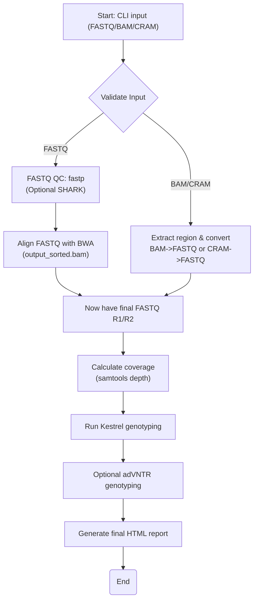
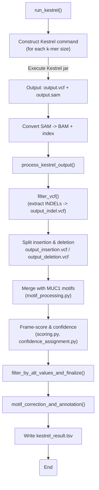

# VNtyper `scripts/` Directory

This directory contains **all** the primary and helper scripts that power VNtyper’s MUC1-VNTR genotyping pipeline. We group them into **two categories**:

1. **Subcommands & Orchestrators**: Scripts that act as entry points or run major parts of the pipeline.  
2. **Helper Modules**: Smaller, single-purpose scripts that handle parsing, scoring, reporting, or reference installation.

---

## 1. Subcommands & Orchestrators

### 1.1 `pipeline.py`

- **Role**: **Main pipeline** driver for local genotyping (FASTQ/BAM/CRAM).  
- **Usage**: Invoked by `vntyper pipeline`.  
- **Logic Overview**:

1. **Validate input**: Ensure user provides either FASTQ or BAM/CRAM.  
2. **FASTQ path**:
   - **QC** with fastp (optional SHARK filtering first).  
   - **Align** with BWA → produce sorted BAM.  
   - Convert that BAM → region-sliced FASTQ if needed.  
3. **BAM/CRAM path**:  
   - Directly slice (using `bed` or default region), then convert to FASTQ.  
4. **Coverage**: Calculate MUC1 region coverage with `samtools depth`.  
5. **Kestrel**: Mapping-free genotyping.  
6. **Optional**: adVNTR.  
7. **Summary**: Generates HTML report.  

### 1.2 `kestrel_genotyping.py`

- **Role**: **Orchestrates** mapping-free genotyping using Kestrel, then applies all **postprocessing** steps (INDEL filtering, motif annotation, coverage-based confidence scoring).  
- **Logic Overview**:

1. **Construct command** for each k-mer size (often just 20).  
2. **Kestrel** jar produces `output.vcf` and intermediate `output.sam`.  
3. **Convert** that SAM → `output.bam`.  
4. **Postprocess** the raw VCF by extracting only **INDEL** calls, splitting them into “insertion” vs. “deletion.”  
5. **Motif merging** + frame/coverage logic (Saei et al., iScience 26, 107171).  
6. **Confidence** assigned (Low vs. High Precision).  
7. Final data is **written** as `kestrel_result.tsv`.

---

### 1.3 `install_references.py`

- **Role**: Installs and indexes reference files needed by VNtyper (e.g., UCSC references, MUC1 motif files).  
- **Usage**: Invoked by `vntyper install-references`.  
- **Key Steps**:
  1. Reads `install_references_config.json`.  
  2. Downloads and verifies archives (MD5 checks).  
  3. Optionally indexes them (if not skipping).

### 1.4 `online_mode.py`

- **Role**: Subsets a local BAM to MUC1 region, then submits to an **online VNtyper server**.  
- **Usage**: Invoked by `vntyper online`.  
- **Key Steps**: Slices the user’s BAM with `samtools view`, calls the remote API, downloads final results.

### 1.5 `cli.py`

- **Role**: **VNtyper’s CLI** entry point.  
- **Contains**:
  - `main()`: Defines subcommands (`pipeline`, `fastq`, `bam`, `kestrel`, etc.).  
  - Dispatches to the appropriate script or function.

---

## 2. Helper Modules

### 2.1 `alignment_processing.py`
- **Purpose**: BWA alignment tasks.  
- **Key Functions**:  
  - `align_and_sort_fastq()`: Align FASTQ → sorted BAM.  
  - `check_bwa_index()`: Verifies all BWA index files exist.

### 2.2 `fastq_bam_processing.py`
- **Purpose**: Converting BAM/CRAM ↔ FASTQ, plus optional QC.  
- **Key Functions**:  
  - `process_bam_to_fastq()`: Slices/filters a BAM/CRAM → FASTQ.  
  - `process_fastq()`: Runs **fastp** to clean raw FASTQ.  
  - `calculate_vntr_coverage()`: Depth over MUC1 region.

### 2.3 `file_processing.py`
- **Purpose**: VCF manipulations for INDEL extraction.  
- **Key Functions**:  
  - `filter_vcf()`: Extracts indels to `output_indel.vcf`.  
  - `filter_indel_vcf()`: Splits those into `insertion.vcf` vs. `deletion.vcf`.

### 2.4 `motif_processing.py`
- **Purpose**: **MUC1 motifs**—loading references, annotation, left/right split.  
- **Key Functions**:  
  - `load_muc1_reference()`: MUC1 reference from FASTA.  
  - `preprocessing_insertion()`/`preprocessing_deletion()`: Merge variants with motif references.  
  - `motif_correction_and_annotation()`: Adjusts positions, excludes certain motifs.

### 2.5 `variant_parsing.py`
- **Purpose**: VCF → DataFrame + final ALT-based filtering.  
- **Key Functions**:  
  - `read_vcf_without_comments()`: Reads VCF ignoring “##” lines.  
  - `filter_by_alt_values_and_finalize()`: Removes undesired ALTs, drops intermediate columns (like ‘left’, ‘right’).

### 2.6 `scoring.py`
- **Purpose**: Frame-score calculations, extracting frameshifts.  
- **Key Functions**:  
  - `split_depth_and_calculate_frame_score()`: Derive `(ALT_len - REF_len)/3`.  
  - `split_frame_score()`, `extract_frameshifts()`: Distinguish insertion vs. deletion frames (3n+1 / 3n+2).

### 2.7 `confidence_assignment.py`
- **Purpose**: Assign textual **confidence** (Low/High Precision) based on coverage ratio.  
- **Key Functions**:  
  - `calculate_depth_score_and_assign_confidence()`: Compares `Depth_Score` and alt-depth to thresholds from config.

### 2.8 `generate_report.py`
- **Purpose**: Produces final HTML summary for single-sample analysis.  
- **Key Functions**:  
  - `generate_summary_report()`: Loads logs/coverage, merges Kestrel + adVNTR results, and renders Jinja2 template.  
  - `run_igv_report()`: Optional IGV-based coverage snapshots.

### 2.9 `cohort_summary.py`
- **Purpose**: Aggregates multi-run data into a single “cohort summary.”  
- **Key Steps**:  
  - Finds `kestrel_result.tsv` across multiple sample directories.  
  - Renders combined data via a Jinja2 template.

### 2.10 `utils.py`
- **Purpose**: Common utility functions (logging, config loading, command execution).  
- **Key Functions**:  
  - `run_command()`: Shell command runner with logging.  
  - `create_output_directories()`: Makes standard pipeline dirs.  
  - `validate_bam_file()`, `validate_fastq_file()`: Basic file checks.

---

## How It All Ties Together

1. **CLI** (`cli.py`) → picks which subcommand to run (`pipeline`, `install-references`, `kestrel`, etc.).  
2. **`pipeline.py`**: The main local genotyping flow. It calls smaller modules for alignment (`alignment_processing.py`), slicing/QC (`fastq_bam_processing.py`), coverage checks, then delegates to **`kestrel_genotyping.py`** for mapping-free variant calling.  
3. **`kestrel_genotyping.py`**: Produces a raw VCF and orchestrates a multi-step filter + scoring chain (using `file_processing.py`, `motif_processing.py`, `scoring.py`, `confidence_assignment.py`, `variant_parsing.py`).  
4. Finally, **`generate_report.py`** or **`cohort_summary.py`** produce HTML reports or aggregated results.
